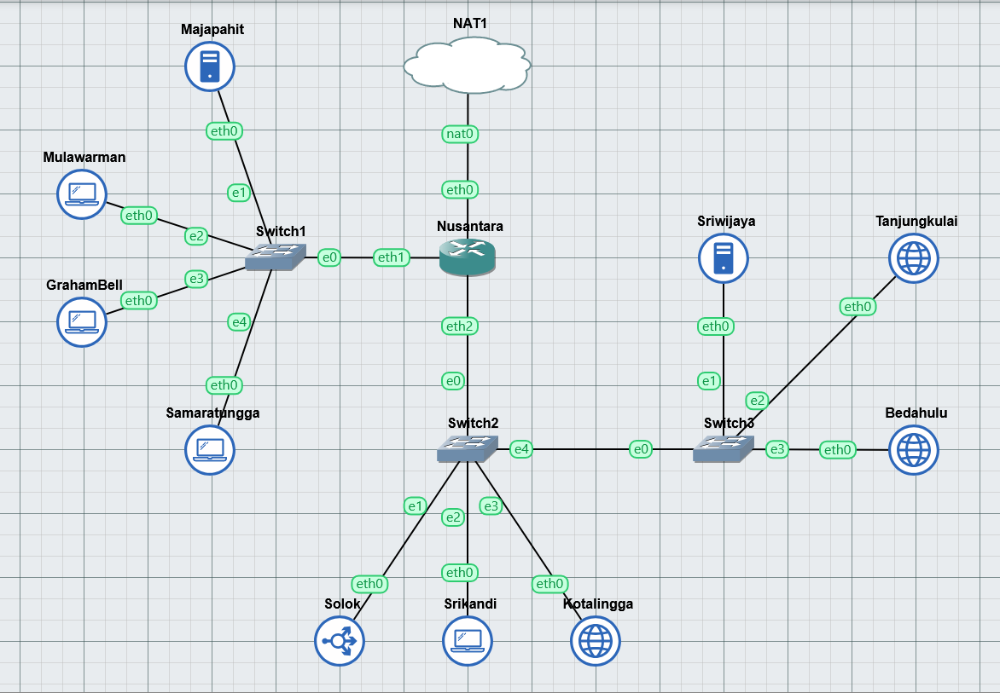
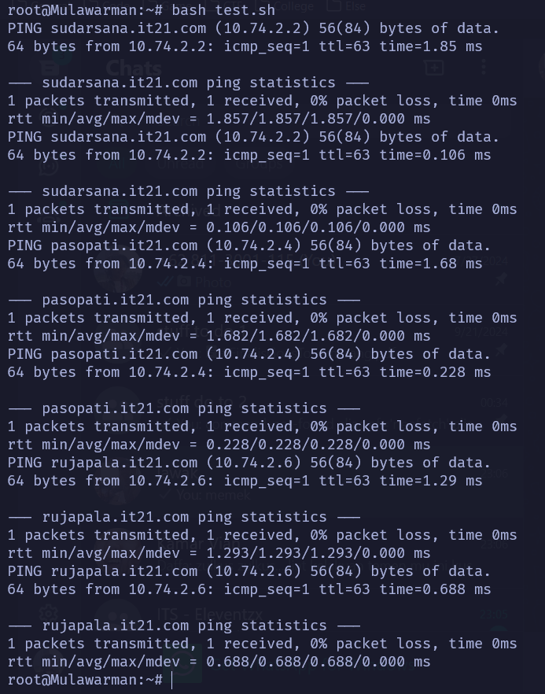
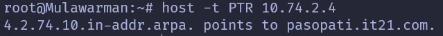

# Jarkom-Modul-2-IT21-2024

|Nama  | NRP |
|--|--|
| Nathan Kho Pancras | 5027221002 |
| Muhammad Andrean Rizq Prasetio | 5027221052 |

**Deskripsi** - Sebuah kerajaan besar di Indonesia sedang mengalami pertempuran dengan penjajah. Kerajaan tersebut adalah Sriwijaya. Karena merasa terdesak Sriwijaya meminta bantuan pada Majapahit untuk mempertahankan wilayahnya. Pertempuran besar tersebut berada di Nusantara. Untuk topologi lihat pada link ini.

## Prerequisites

### Topologi



### Konfigurasi

```bash
vi /etc/network/interfaces
cat /etc/network/interfaces
```

**Nusantara**

```
auto eth0
iface eth0 inet dhcp

auto eth1
iface eth1 inet static
	address 10.74.1.1
	netmask 255.255.255.0

auto eth2
iface eth2 inet static
	address 10.74.2.1
	netmask 255.255.255.0
```

**Majapahit**

```
auto eth0
iface eth0 inet static
	address 10.74.1.2
	netmask 255.255.255.0
	gateway 10.74.1.1
```

**Mulawarman**

```
auto eth0
iface eth0 inet static
	address 10.74.1.3
	netmask 255.255.255.0
	gateway 10.74.1.1
```


**GrahamBell**

```
auto eth0
iface eth0 inet static
	address 10.74.1.4
	netmask 255.255.255.0
	gateway 10.74.1.1
```

**Samaratungga**

```
auto eth0
iface eth0 inet static
	address 10.74.1.5
	netmask 255.255.255.0
	gateway 10.74.1.1
```

**Solok**

```
auto eth0
iface eth0 inet static
	address 10.74.2.2
	netmask 255.255.255.0
	gateway 10.74.2.1
```

**Srikandi**

```
auto eth0
iface eth0 inet static
	address 10.74.2.3
	netmask 255.255.255.0
	gateway 10.74.2.1
```

**Kotalingga**

```
auto eth0
iface eth0 inet static
	address 10.74.2.4
	netmask 255.255.255.0
	gateway 10.74.2.1
```

**Sriwijaya**

```
auto eth0
iface eth0 inet static
	address 10.74.2.5
	netmask 255.255.255.0
	gateway 10.74.2.1
```

**Tanjungkulai**

```
auto eth0
iface eth0 inet static
	address 10.74.2.6
	netmask 255.255.255.0
	gateway 10.74.2.1
```

**Bedahulu**

```
auto eth0
iface eth0 inet static
	address 10.74.2.7
	netmask 255.255.255.0
	gateway 10.74.2.1
```

### Set .bashrc

**Router (Nusantara)**

```bash
iptables -t nat -A POSTROUTING -o eth0 -j MASQUERADE -s 10.74.0.0/16
echo nameserver 192.168.122.1 > /etc/resolv.conf
```

**DNS Master**

Sriwijaya

```bash
echo nameserver 192.168.122.1 > /etc/resolv.conf
apt-get update
apt-get install bind9 -y
service bind9 start
```

**DNS Slave**

Majapahit, Tanjungkulai, Bedahulu

```bash
echo nameserver 192.168.122.1 > /etc/resolv.conf
apt-get update
apt-get install bind9 -y
service bind9 start
apt-get install apache2 -y
service apache2 start
apt-get install lynx -y
apt-get install php -y
```

**Clients**

```bash
echo 'nameserver 10.74.2.5
nameserver 10.74.1.2' > /etc/resolv.conf
```

## Soal

### No 1

Untuk mempersiapkan peperangan World War MMXXIV (Iya sebanyak itu), Sriwijaya membuat dua kotanya menjadi web server yaitu Tanjungkulai, dan Bedahulu, serta Sriwijaya sendiri akan menjadi DNS Master. Kemudian karena merasa terdesak, Majapahit memberikan bantuan dan menjadikan kerajaannya (Majapahit) menjadi DNS Slave. 

**Pengerjaan**

Karena di `.bashrc` sudah melakukan instalasi ke package bind9, dan tambahan lain untuk DNS Slave (apache, lynx, php), nomor ini sudah selesai.

### No 2

Karena para pasukan membutuhkan koordinasi untuk melancarkan serangannya, maka buatlah sebuah domain yang mengarah ke Solok dengan alamat sudarsana.xxxx.com dengan alias www.sudarsana.xxxx.com, dimana xxxx merupakan kode kelompok. Contoh: sudarsana.it01.com.

**Pengerjaan**

Sriwijaya - `sudarsana.sh`

```bash
echo 'zone "sudarsana.it21.com" {
	type master;
	file "/etc/bind/jarkom/sudarsana.it21.com";
};' >> /etc/bind/named.conf.local

mkdir /etc/bind/jarkom
cp /etc/bind/db.local /etc/bind/jarkom/sudarsana.it21.com
service bind9 restart

echo ';
; BIND data file for local loopback interface
;
$TTL    604800
@       IN      SOA     sudarsana.it21.com. root.sudarsana.it21.com. (
                              2         ; Serial
                         604800         ; Refresh
                          86400         ; Retry
                        2419200         ; Expire
                         604800 )       ; Negative Cache TTL
;
@       IN      NS      sudarsana.it21.com.
@       IN      A       10.74.2.2		; IP solok
www	IN		CNAME	sudarsana.it21.com.
@       IN      AAAA    ::1' >  /etc/bind/jarkom/sudarsana.it21.com
```

### No 3

Para pasukan juga perlu mengetahui mana titik yang akan diserang, sehingga dibutuhkan domain lain yaitu pasopati.xxxx.com dengan alias www.pasopati.xxxx.com yang mengarah ke Kotalingga.

**Pengerjaan**

Sriwijaya - `pasopati.sh`

```bash
echo 'zone "pasopati.it21.com" {
 	type master;
 	file "/etc/bind/jarkom/pasopati.it21.com"; 
};' >> /etc/bind/named.conf.local

cp /etc/bind/db.local /etc/bind/jarkom/pasopati.it21.com

service bind9 restart

echo ';
; BIND data file for local loopback interface
;
$TTL    604800
@       IN      SOA     pasopati.it21.com. root.pasopati.it21.com. (
                              2         ; Serial
                         604800         ; Refresh
                          86400         ; Retry
                        2419200         ; Expire
                         604800 )       ; Negative Cache TTL
;
@       IN      NS      pasopati.it21.com.
@       IN      A       10.74.2.4		; IP kotalingga
www		IN		CNAME	pasopati.it21.com.
@       IN      AAAA    ::1' >  /etc/bind/jarkom/pasopati.it21.com
```

### No 4

Markas pusat meminta dibuatnya domain khusus untuk menaruh informasi persenjataan dan suplai yang tersebar. Informasi dan suplai meme terbaru tersebut mengarah ke Tanjungkulai dan domain yang ingin digunakan adalah rujapala.xxxx.com dengan alias www.rujapala.xxxx.com.

**Pengerjaan**

Sriwijaya - `rujapala.sh`

```bash
echo 'zone "rujapala.it21.com" {
 	type master;
 	file "/etc/bind/jarkom/rujapala.it21.com"; 
};' >> /etc/bind/named.conf.local

cp /etc/bind/db.local /etc/bind/jarkom/rujapala.it21.com

service bind9 restart

echo ';
; BIND data file for local loopback interface
;
$TTL    604800
@       IN      SOA     rujapala.it21.com. root.rujapala.it21.com. (
                              2         ; Serial
                         604800         ; Refresh
                          86400         ; Retry
                        2419200         ; Expire
                         604800 )       ; Negative Cache TTL
;
@       IN      NS      rujapala.it21.com.
@       IN      A       10.74.2.6		; IP tanjungkulai
www		IN		CNAME	rujapala.it21.com.
@       IN      AAAA    ::1' >  /etc/bind/jarkom/rujapala.it21.com
```

**Shell script - `master.sh`**

```bash
echo 'zone "sudarsana.it21.com" {
	type master;
	file "/etc/bind/jarkom/sudarsana.it21.com";
};

zone "pasopati.it21.com" {
 	type master;
 	file "/etc/bind/jarkom/pasopati.it21.com"; 
};

zone "rujapala.it21.com" {
 	type master;
 	file "/etc/bind/jarkom/rujapala.it21.com"; 
};' > /etc/bind/named.conf.local

mkdir /etc/bind/jarkom
cp /etc/bind/db.local /etc/bind/jarkom/sudarsana.it21.com
cp /etc/bind/db.local /etc/bind/jarkom/pasopati.it21.com
cp /etc/bind/db.local /etc/bind/jarkom/rujapala.it21.com

echo ';
; BIND data file for local loopback interface
;

$TTL    604800
@       IN      SOA     sudarsana.it21.com. root.sudarsana.it21.com. (
                              2         ; Serial
                         604800         ; Refresh
                          86400         ; Retry
                        2419200         ; Expire
                         604800 )       ; Negative Cache TTL
;
@       IN      NS      sudarsana.it21.com.
@       IN      A       10.74.2.2		; IP solok
www	IN		CNAME	sudarsana.it21.com.' >  /etc/bind/jarkom/sudarsana.it21.com

echo ';
; BIND data file for local loopback interface
;
$TTL    604800
@       IN      SOA     pasopati.it21.com. root.pasopati.it21.com. (
                              2         ; Serial
                         604800         ; Refresh
                          86400         ; Retry
                        2419200         ; Expire
                         604800 )       ; Negative Cache TTL
;
@       IN      NS      pasopati.it21.com.
@       IN      A       10.74.2.4		; IP kotalingga
www	IN	CNAME	pasopati.it21.com.' >  /etc/bind/jarkom/pasopati.it21.com

echo ';
; BIND data file for local loopback interface
;
$TTL    604800
@       IN      SOA     rujapala.it21.com. root.rujapala.it21.com. (
                              2         ; Serial
                         604800         ; Refresh
                          86400         ; Retry
                        2419200         ; Expire
                         604800 )       ; Negative Cache TTL
;	
@       IN      NS      rujapala.it21.com.
@       IN      A       10.74.2.6		; IP tanjungkulai
www	IN	CNAME	rujapala.it21.com.' >  /etc/bind/jarkom/rujapala.it21.com

service bind9 restart
```

### No 5

Pastikan domain-domain tersebut dapat diakses oleh seluruh komputer (client) yang berada di Nusantara.

Bisa dilakukan cek di setiap client menggunakan command-command berikut:

```bash
ping sudarsana.it21.com -c 1
ping www.sudarsana.it21.com -c 1
ping pasopati.it21.com -c 1
ping www.pasopati.it21.com -c 1
ping rujapala.it21.com -c 1
ping www.rujapala.it21.com -c 1
```

Tes di Mulawarman - **Berhasil**



**Pengerjaan**

### No 6

Beberapa daerah memiliki keterbatasan yang menyebabkan hanya dapat mengakses domain secara langsung melalui alamat IP domain tersebut. Karena daerah tersebut tidak diketahui secara spesifik, pastikan semua komputer (client) dapat mengakses domain pasopati.xxxx.com melalui alamat IP Kotalingga (Notes: menggunakan pointer record).

**Pengerjaan**

```bash
echo 'zone "2.74.10.in-addr.arpa" [
type master;
file "/etc/bind/jarkom/2.74.10.in-addr.arpa";
};' >> /etc/bind/named.conf.local

cp /etc/bind/db.local /etc/bind/jarkom/2.74.10.in-addr.arpa

echo ';
; BIND data file for reverse DNS lookup
;
$TTL    604800
@       IN      SOA     pasopati.it21.com. root.pasopati.it21.com. (
                              2         ; Serial
                         604800         ; Refresh
                          86400         ; Retry
                        2419200         ; Expire
                         604800 )       ; Negative Cache TTL
;	
@       IN      NS      pasopati.it21.com.
4       IN      PTR     pasopati.it21.com.' >  /etc/bind/jarkom/2.74.10.in-addr.arpa

service bind9 restart
```

**Shell script - `master.sh`**

```bash
echo 'zone "sudarsana.it21.com" {
	type master;
	file "/etc/bind/jarkom/sudarsana.it21.com";
};

zone "pasopati.it21.com" {
 	type master;
 	file "/etc/bind/jarkom/pasopati.it21.com"; 
};

zone "rujapala.it21.com" {
 	type master;
 	file "/etc/bind/jarkom/rujapala.it21.com"; 
};

zone "2.74.10.in-addr.arpa" {
	type master;
	file "/etc/bind/jarkom/2.74.10.in-addr.arpa";
};' > /etc/bind/named.conf.local

mkdir -p /etc/bind/jarkom
cp /etc/bind/db.local /etc/bind/jarkom/sudarsana.it21.com
cp /etc/bind/db.local /etc/bind/jarkom/pasopati.it21.com
cp /etc/bind/db.local /etc/bind/jarkom/rujapala.it21.com
cp /etc/bind/db.local /etc/bind/jarkom/2.74.10.in-addr.arpa

echo ';
; BIND data file for local loopback interface
;

$TTL    604800
@       IN      SOA     sudarsana.it21.com. root.sudarsana.it21.com. (
                              2         ; Serial
                         604800         ; Refresh
                          86400         ; Retry
                        2419200         ; Expire
                         604800 )       ; Negative Cache TTL
;
@       IN      NS      sudarsana.it21.com.
@       IN      A       10.74.2.2		; IP solok
www	IN		CNAME	sudarsana.it21.com.' >  /etc/bind/jarkom/sudarsana.it21.com

echo ';
; BIND data file for local loopback interface
;
$TTL    604800
@       IN      SOA     pasopati.it21.com. root.pasopati.it21.com. (
                              2         ; Serial
                         604800         ; Refresh
                          86400         ; Retry
                        2419200         ; Expire
                         604800 )       ; Negative Cache TTL
;
@       IN      NS      pasopati.it21.com.
@       IN      A       10.74.2.4		; IP kotalingga
www	IN	CNAME	pasopati.it21.com.' >  /etc/bind/jarkom/pasopati.it21.com

echo ';
; BIND data file for local loopback interface
;
$TTL    604800
@       IN      SOA     rujapala.it21.com. root.rujapala.it21.com. (
                              2         ; Serial
                         604800         ; Refresh
                          86400         ; Retry
                        2419200         ; Expire
                         604800 )       ; Negative Cache TTL
;	
@       IN      NS      rujapala.it21.com.
@       IN      A       10.74.2.6		; IP tanjungkulai
www	IN	CNAME	rujapala.it21.com.' >  /etc/bind/jarkom/rujapala.it21.com

echo ';
; BIND data file for reverse DNS lookup
;
$TTL    604800
@       IN      SOA     pasopati.it21.com. root.pasopati.it21.com. (
                              2         ; Serial
                         604800         ; Refresh
                          86400         ; Retry
                        2419200         ; Expire
                         604800 )       ; Negative Cache TTL
;	
@       IN      NS      pasopati.it21.com.
4       IN      PTR     pasopati.it21.com.' >  /etc/bind/jarkom/2.74.10.in-addr.arpa

service bind9 restart
```

Tes di Mulawarman - **Berhasil**



### No 7

Akhir-akhir ini seringkali terjadi serangan brainrot ke DNS Server Utama, sebagai tindakan antisipasi kamu diperintahkan untuk membuat DNS Slave di Majapahit untuk semua domain yang sudah dibuat sebelumnya yang mengarah ke Sriwijaya.

**Pengerjaan**

**Shell script - `master.sh`**

```bash
echo 'zone "sudarsana.it21.com" {
	type master;
    notify yes;
    also-notify { 10.74.1.2; }; // IP Majapahit
    allow-transfer { 10.74.1.2; }; // IP Majapahit
	file "/etc/bind/jarkom/sudarsana.it21.com";
};

zone "pasopati.it21.com" {
 	type master;
    notify yes;
    also-notify { 10.74.1.2; }; // IP Majapahit
    allow-transfer { 10.74.1.2; }; // IP Majapahit
 	file "/etc/bind/jarkom/pasopati.it21.com"; 
};

zone "rujapala.it21.com" {
 	type master;
    notify yes;
    also-notify { 10.74.1.2; }; // IP Majapahit
    allow-transfer { 10.74.1.2; }; // IP Majapahit
 	file "/etc/bind/jarkom/rujapala.it21.com"; 
};

zone "2.74.10.in-addr.arpa" {
	type master;
	file "/etc/bind/jarkom/2.74.10.in-addr.arpa";
};' > /etc/bind/named.conf.local

mkdir -p /etc/bind/jarkom
cp /etc/bind/db.local /etc/bind/jarkom/sudarsana.it21.com
cp /etc/bind/db.local /etc/bind/jarkom/pasopati.it21.com
cp /etc/bind/db.local /etc/bind/jarkom/rujapala.it21.com
cp /etc/bind/db.local /etc/bind/jarkom/2.74.10.in-addr.arpa

echo ';
; BIND data file for local loopback interface
;

$TTL    604800
@       IN      SOA     sudarsana.it21.com. root.sudarsana.it21.com. (
                              2         ; Serial
                         604800         ; Refresh
                          86400         ; Retry
                        2419200         ; Expire
                         604800 )       ; Negative Cache TTL
;
@       IN      NS      sudarsana.it21.com.
@       IN      A       10.74.2.2		; IP solok
www	IN		CNAME	sudarsana.it21.com.' >  /etc/bind/jarkom/sudarsana.it21.com

echo ';
; BIND data file for local loopback interface
;
$TTL    604800
@       IN      SOA     pasopati.it21.com. root.pasopati.it21.com. (
                              2         ; Serial
                         604800         ; Refresh
                          86400         ; Retry
                        2419200         ; Expire
                         604800 )       ; Negative Cache TTL
;
@       IN      NS      pasopati.it21.com.
@       IN      A       10.74.2.4		; IP kotalingga
www	IN	CNAME	pasopati.it21.com.' >  /etc/bind/jarkom/pasopati.it21.com

echo ';
; BIND data file for local loopback interface
;
$TTL    604800
@       IN      SOA     rujapala.it21.com. root.rujapala.it21.com. (
                              2         ; Serial
                         604800         ; Refresh
                          86400         ; Retry
                        2419200         ; Expire
                         604800 )       ; Negative Cache TTL
;	
@       IN      NS      rujapala.it21.com.
@       IN      A       10.74.2.6		; IP tanjungkulai
www	IN	CNAME	rujapala.it21.com.' >  /etc/bind/jarkom/rujapala.it21.com

echo ';
; BIND data file for reverse DNS lookup
;
$TTL    604800
@       IN      SOA     pasopati.it21.com. root.pasopati.it21.com. (
                              2         ; Serial
                         604800         ; Refresh
                          86400         ; Retry
                        2419200         ; Expire
                         604800 )       ; Negative Cache TTL
;	
@       IN      NS      pasopati.it21.com.
4       IN      PTR     pasopati.it21.com.' >  /etc/bind/jarkom/2.74.10.in-addr.arpa

service bind9 restart
```

**Shell script - `slave.sh`**
```bash
echo 'zone "sudarsana.it21.com" {
	type slave;
    masters { 10.74.2.5 }
	file "/etc/bind/jarkom/sudarsana.it21.com";
};

zone "pasopati.it21.com" {
 	type slave;
    masters { 10.74.2.5 }
 	file "/etc/bind/jarkom/pasopati.it21.com"; 
};

zone "rujapala.it21.com" {
 	type slave;
    masters { 10.74.2.5 }
 	file "/etc/bind/jarkom/rujapala.it21.com"; 
};' > /etc/bind/named.conf.local

mkdir -p /etc/bind/jarkom

echo ';
; BIND data file for local loopback interface
;

$TTL    604800
@       IN      SOA     sudarsana.it21.com. root.sudarsana.it21.com. (
                              2         ; Serial
                         604800         ; Refresh
                          86400         ; Retry
                        2419200         ; Expire
                         604800 )       ; Negative Cache TTL
;
@       IN      NS      sudarsana.it21.com.
@       IN      A       10.74.2.2		; IP solok
www	IN		CNAME	sudarsana.it21.com.' >  /etc/bind/jarkom/sudarsana.it21.com

echo ';
; BIND data file for local loopback interface
;
$TTL    604800
@       IN      SOA     pasopati.it21.com. root.pasopati.it21.com. (
                              2         ; Serial
                         604800         ; Refresh
                          86400         ; Retry
                        2419200         ; Expire
                         604800 )       ; Negative Cache TTL
;
@       IN      NS      pasopati.it21.com.
@       IN      A       10.74.2.4		; IP kotalingga
www	IN	CNAME	pasopati.it21.com.' >  /etc/bind/jarkom/pasopati.it21.com

echo ';
; BIND data file for local loopback interface
;
$TTL    604800
@       IN      SOA     rujapala.it21.com. root.rujapala.it21.com. (
                              2         ; Serial
                         604800         ; Refresh
                          86400         ; Retry
                        2419200         ; Expire
                         604800 )       ; Negative Cache TTL
;	
@       IN      NS      rujapala.it21.com.
@       IN      A       10.74.2.6		; IP tanjungkulai
www	IN	CNAME	rujapala.it21.com.' >  /etc/bind/jarkom/rujapala.it21.com
```

### No 8

Kamu juga diperintahkan untuk membuat subdomain khusus melacak kekuatan tersembunyi di Ohio dengan subdomain cakra.sudarsana.xxxx.com yang mengarah ke Bedahulu.

**Pengerjaan**

Tambahkan Subdomain cakra yang mengarah ke Node Bendahulu

**Shell script - `master.sh`**

```bash
echo 'zone "sudarsana.it21.com" {
	type master;
    notify yes;
    also-notify { 10.74.1.2; }; // IP Majapahit
    allow-transfer { 10.74.1.2; }; // IP Majapahit
	file "/etc/bind/jarkom/sudarsana.it21.com";
};

zone "pasopati.it21.com" {
 	type master;
    notify yes;
    also-notify { 10.74.1.2; }; // IP Majapahit
    allow-transfer { 10.74.1.2; }; // IP Majapahit
 	file "/etc/bind/jarkom/pasopati.it21.com"; 
};

zone "rujapala.it21.com" {
 	type master;
    notify yes;
    also-notify { 10.74.1.2; }; // IP Majapahit
    allow-transfer { 10.74.1.2; }; // IP Majapahit
 	file "/etc/bind/jarkom/rujapala.it21.com"; 
};

zone "2.74.10.in-addr.arpa" {
	type master;
	file "/etc/bind/jarkom/2.74.10.in-addr.arpa";
};' > /etc/bind/named.conf.local

mkdir -p /etc/bind/jarkom
cp /etc/bind/db.local /etc/bind/jarkom/sudarsana.it21.com
cp /etc/bind/db.local /etc/bind/jarkom/pasopati.it21.com
cp /etc/bind/db.local /etc/bind/jarkom/rujapala.it21.com
cp /etc/bind/db.local /etc/bind/jarkom/2.74.10.in-addr.arpa

echo ';
; BIND data file for local loopback interface
;

$TTL    604800
@       IN      SOA     sudarsana.it21.com. root.sudarsana.it21.com. (
                              2         ; Serial
                         604800         ; Refresh
                          86400         ; Retry
                        2419200         ; Expire
                         604800 )       ; Negative Cache TTL
;
@       IN      NS      sudarsana.it21.com.
@       IN      A       10.74.2.2		; IP solok
cakra   IN      A       10.74.2.7   ; IP Bedahulu
www	IN		CNAME	sudarsana.it21.com.' >  /etc/bind/jarkom/sudarsana.it21.com

echo ';
; BIND data file for local loopback interface
;
$TTL    604800
@       IN      SOA     pasopati.it21.com. root.pasopati.it21.com. (
                              2         ; Serial
                         604800         ; Refresh
                          86400         ; Retry
                        2419200         ; Expire
                         604800 )       ; Negative Cache TTL
;
@       IN      NS      pasopati.it21.com.
@       IN      A       10.74.2.4		; IP kotalingga
www	IN	CNAME	pasopati.it21.com.' >  /etc/bind/jarkom/pasopati.it21.com

echo ';
; BIND data file for local loopback interface
;
$TTL    604800
@       IN      SOA     rujapala.it21.com. root.rujapala.it21.com. (
                              2         ; Serial
                         604800         ; Refresh
                          86400         ; Retry
                        2419200         ; Expire
                         604800 )       ; Negative Cache TTL
;	
@       IN      NS      rujapala.it21.com.
@       IN      A       10.74.2.6		; IP tanjungkulai
www	IN	CNAME	rujapala.it21.com.' >  /etc/bind/jarkom/rujapala.it21.com

echo ';
; BIND data file for reverse DNS lookup
;
$TTL    604800
@       IN      SOA     pasopati.it21.com. root.pasopati.it21.com. (
                              2         ; Serial
                         604800         ; Refresh
                          86400         ; Retry
                        2419200         ; Expire
                         604800 )       ; Negative Cache TTL
;	
@       IN      NS      pasopati.it21.com.
ns1     IN      A       10.74.2.4       ; IP Kotalingga
panah   IN      NS      ns1
4       IN      PTR     pasopati.it21.com.' >  /etc/bind/jarkom/2.74.10.in-addr.arpa

service bind9 restart
```

### No 9

Karena terjadi serangan DDOS oleh shikanoko nokonoko koshitantan (NUN), sehingga sistem komunikasinya terhalang. Untuk melindungi warga, kita diperlukan untuk membuat sistem peringatan dari siren man oleh Frekuensi Freak dan memasukkannya ke subdomain panah.pasopati.xxxx.com dalam folder panah dan pastikan dapat diakses secara mudah dengan menambahkan alias www.panah.pasopati.xxxx.com dan mendelegasikan subdomain tersebut ke Majapahit dengan alamat IP menuju radar di Kotalingga.

**Pengerjaan**

### No 10

Markas juga meminta catatan kapan saja meme brain rot akan dijatuhkan, maka buatlah subdomain baru di subdomain panah yaitu log.panah.pasopati.xxxx.com serta aliasnya www.log.panah.pasopati.xxxx.com yang juga mengarah ke Kotalingga.

**Pengerjaan**

### No 11

Setelah pertempuran mereda, warga IT dapat kembali mengakses jaringan luar dan menikmati meme brainrot terbaru, tetapi hanya warga Majapahit saja yang dapat mengakses jaringan luar secara langsung. Buatlah konfigurasi agar warga IT yang berada diluar Majapahit dapat mengakses jaringan luar melalui DNS Server Majapahit.

**Pengerjaan**

### No 12

Karena pusat ingin sebuah laman web yang ingin digunakan untuk memantau kondisi kota lainnya maka deploy laman web ini (cek resource yg lb) pada Kotalingga menggunakan apache.

**Pengerjaan**

### No 13

Karena Sriwijaya dan Majapahit memenangkan pertempuran ini dan memiliki banyak uang dari hasil penjarahan (sebanyak 35 juta, belum dipotong pajak) maka pusat meminta kita memasang load balancer untuk membagikan uangnya pada web nya, dengan Kotalingga, Bedahulu, Tanjungkulai sebagai worker dan Solok sebagai Load Balancer menggunakan apache sebagai web server nya dan load balancer nya.

**Pengerjaan**

### No 14

Selama melakukan penjarahan mereka melihat bagaimana web server luar negeri, hal ini membuat mereka iri, dengki, sirik dan ingin flexing sehingga meminta agar web server dan load balancer nya diubah menjadi nginx.

**Pengerjaan**

### No 15

Markas pusat meminta laporan hasil benchmark dengan menggunakan apache benchmark dari load balancer dengan 2 web server yang berbeda tersebut dan meminta secara detail dengan ketentuan:
Nama Algoritma Load Balancer
Report hasil testing apache benchmark 
Grafik request per second untuk masing masing algoritma. 
Analisis
Meme terbaik kalian (terserah ( ͡° ͜ʖ ͡°)) 🤓

**Pengerjaan**

### No 16

Karena dirasa kurang aman dari brainrot karena masih memakai IP, markas ingin akses ke Solok memakai solok.xxxx.com dengan alias www.solok.xxxx.com (sesuai web server terbaik hasil analisis kalian).

**Pengerjaan**

### No 17

Agar aman, buatlah konfigurasi agar solok.xxx.com hanya dapat diakses melalui port sebesar π x 10^4 = (phi nya desimal) dan 2000 + 2000 log 10 (10) +700 - π = ?.

**Pengerjaan**

### No 18

Apa bila ada yang mencoba mengakses IP solok akan secara otomatis dialihkan ke www.solok.xxxx.com.

**Pengerjaan**

### No 19

Karena probset sudah kehabisan ide masuk ke salah satu worker buatkan akses direktori listing yang mengarah ke resource worker2.

**Pengerjaan**

### No 20

Worker tersebut harus dapat di akses dengan sekiantterimakasih.xxxx.com dengan alias www.sekiantterimakasih.xxxx.com.

**Pengerjaan**
