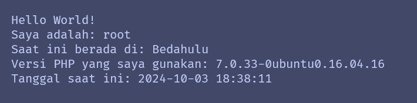

# Jarkom-Modul-2-IT21-2024

|Nama  | NRP |
|--|--|
| Nathan Kho Pancras | 5027221002 |
| Muhammad Andrean Rizq Prasetio | 5027221052 |

**Deskripsi** - Sebuah kerajaan besar di Indonesia sedang mengalami pertempuran dengan penjajah. Kerajaan tersebut adalah Sriwijaya. Karena merasa terdesak Sriwijaya meminta bantuan pada Majapahit untuk mempertahankan wilayahnya. Pertempuran besar tersebut berada di Nusantara.

## Daftar Isi

- [Jarkom-Modul-2-IT21-2024](#jarkom-modul-2-it21-2024)
  - [Daftar Isi](#daftar-isi)
- [Prerequisites](#prerequisites)
  - [Topologi](#topologi)
  - [Konfigurasi](#konfigurasi)
    - [Set .bashrc](#set-bashrc)
- [Soal](#soal)
    - [No 1](#no-1)
    - [No 2](#no-2)
    - [No 3](#no-3)
    - [No 4](#no-4)
    - [No 5](#no-5)
    - [No 6](#no-6)
    - [No 7](#no-7)
    - [No 8](#no-8)
    - [No 9](#no-9)
    - [No 10](#no-10)
    - [No 11](#no-11)
    - [No 12](#no-12)
    - [No 13](#no-13)
    - [No 14](#no-14)
    - [No 15](#no-15)
    - [No 16](#no-16)
    - [No 17](#no-17)
    - [No 18](#no-18)
    - [No 19](#no-19)
    - [No 20](#no-20)

# Prerequisites

## Topologi


## Konfigurasi

```bash
vi /etc/network/interfaces
cat /etc/network/interfaces
```

**Nusantara**

```
auto eth0
iface eth0 inet dhcp

auto eth1
iface eth1 inet static
	address 10.74.1.1
	netmask 255.255.255.0

auto eth2
iface eth2 inet static
	address 10.74.2.1
	netmask 255.255.255.0
```

**Majapahit**

```
auto eth0
iface eth0 inet static
	address 10.74.1.2
	netmask 255.255.255.0
	gateway 10.74.1.1
```

**Mulawarman**

```
auto eth0
iface eth0 inet static
	address 10.74.1.3
	netmask 255.255.255.0
	gateway 10.74.1.1
```


**GrahamBell**

```
auto eth0
iface eth0 inet static
	address 10.74.1.4
	netmask 255.255.255.0
	gateway 10.74.1.1
```

**Samaratungga**

```
auto eth0
iface eth0 inet static
	address 10.74.1.5
	netmask 255.255.255.0
	gateway 10.74.1.1
```

**Solok**

```
auto eth0
iface eth0 inet static
	address 10.74.2.2
	netmask 255.255.255.0
	gateway 10.74.2.1
```

**Srikandi**

```
auto eth0
iface eth0 inet static
	address 10.74.2.3
	netmask 255.255.255.0
	gateway 10.74.2.1
```

**Kotalingga**

```
auto eth0
iface eth0 inet static
	address 10.74.2.4
	netmask 255.255.255.0
	gateway 10.74.2.1
```

**Sriwijaya**

```
auto eth0
iface eth0 inet static
	address 10.74.2.5
	netmask 255.255.255.0
	gateway 10.74.2.1
```

**Tanjungkulai**

```
auto eth0
iface eth0 inet static
	address 10.74.2.6
	netmask 255.255.255.0
	gateway 10.74.2.1
```

**Bedahulu**

```
auto eth0
iface eth0 inet static
	address 10.74.2.7
	netmask 255.255.255.0
	gateway 10.74.2.1
```

### Set .bashrc

**Router (Nusantara)**

```bash
iptables -t nat -A POSTROUTING -o eth0 -j MASQUERADE -s 10.74.0.0/16
echo nameserver 192.168.122.1 > /etc/resolv.conf
```

**DNS Master**

Sriwijaya

```bash
echo nameserver 192.168.122.1 > /etc/resolv.conf
apt-get update
apt-get install bind9 -y
service bind9 start

bash master.sh
```

**DNS Slave**

Majapahit

```bash
echo nameserver 192.168.122.1 > /etc/resolv.conf
apt-get update
apt-get install bind9 -y
service bind9 start
apt-get install apache2 -y
service apache2 start
apt-get install lynx php -y

bash slave.sh
```

**Web Server**

Kotalingga, Tanjungkulai, Bedahulu

```bash
echo 'nameserver 10.74.2.5
nameserver 10.74.1.2' > /etc/resolv.conf
apt-get update
apt-get install apache2 nginx -y
apt-get install curl -y
apt-get install unzip -y
apt-get install libapache2-mod-php7.0 -y
apt-get install php php-fpm php-mcrypt php-mysql -y

bash worker.sh
```

**Load Balancer**

Solok

```bash
echo 'nameserver 10.74.2.5
nameserver 10.74.1.2' > /etc/resolv.conf
apt-get update
apt-get install apache2 dnsutils nginx php-fpm php lynx -y

bash loadbalancer.sh
```

**Clients**

Mulawarman, GrahamBell, Samaratungga, Srikandi

```bash
echo 'nameserver 10.74.2.5
nameserver 10.74.1.2' > /etc/resolv.conf
apt-get update
apt-get install lynx -y
apt-get install libapache2-mod-php7.0 -y
```

**NOTE**: semua .sh yang ada di .bashrc - master, slave, worker, loadbalancer akan ada di bagian pengerjaan soal. (foreshadowing tutorial penguli handal :thumbsup:)

# Soal

### No 1

Untuk mempersiapkan peperangan World War MMXXIV (Iya sebanyak itu), Sriwijaya membuat dua kotanya menjadi web server yaitu Tanjungkulai, dan Bedahulu, serta Sriwijaya sendiri akan menjadi DNS Master. Kemudian karena merasa terdesak, Majapahit memberikan bantuan dan menjadikan kerajaannya (Majapahit) menjadi DNS Slave. 

**Pengerjaan**

Karena di `.bashrc` sudah melakukan instalasi ke package bind9, dan tambahan lain untuk DNS Slave (apache, lynx, php), nomor ini sudah selesai.

### No 2

Karena para pasukan membutuhkan koordinasi untuk melancarkan serangannya, maka buatlah sebuah domain yang mengarah ke Solok dengan alamat sudarsana.xxxx.com dengan alias www.sudarsana.xxxx.com, dimana xxxx merupakan kode kelompok. Contoh: sudarsana.it01.com.

**Pengerjaan**

Sriwijaya

```bash
echo 'zone "sudarsana.it21.com" {
	type master;
	file "/etc/bind/jarkom/sudarsana.it21.com";
};' >> /etc/bind/named.conf.local

mkdir /etc/bind/jarkom
cp /etc/bind/db.local /etc/bind/jarkom/sudarsana.it21.com
service bind9 restart

echo ';
; BIND data file for local loopback interface
;
$TTL    604800
@       IN      SOA     sudarsana.it21.com. root.sudarsana.it21.com. (
                              2         ; Serial
                         604800         ; Refresh
                          86400         ; Retry
                        2419200         ; Expire
                         604800 )       ; Negative Cache TTL
;
@       IN      NS      sudarsana.it21.com.
@       IN      A       10.74.2.2		; IP solok
www     IN      CNAME   sudarsana.it21.com.
@       IN      AAAA    ::1' >  /etc/bind/jarkom/sudarsana.it21.com
```

### No 3

Para pasukan juga perlu mengetahui mana titik yang akan diserang, sehingga dibutuhkan domain lain yaitu pasopati.xxxx.com dengan alias www.pasopati.xxxx.com yang mengarah ke Kotalingga.

**Pengerjaan**

Sriwijaya

```bash
echo 'zone "pasopati.it21.com" {
 	type master;
 	file "/etc/bind/jarkom/pasopati.it21.com"; 
};' >> /etc/bind/named.conf.local

cp /etc/bind/db.local /etc/bind/jarkom/pasopati.it21.com

service bind9 restart

echo ';
; BIND data file for local loopback interface
;
$TTL    604800
@       IN      SOA     pasopati.it21.com. root.pasopati.it21.com. (
                              2         ; Serial
                         604800         ; Refresh
                          86400         ; Retry
                        2419200         ; Expire
                         604800 )       ; Negative Cache TTL
;
@       IN      NS      pasopati.it21.com.
@       IN      A       10.74.2.4		; IP kotalingga
www     IN      CNAME   pasopati.it21.com.
@       IN      AAAA    ::1' >  /etc/bind/jarkom/pasopati.it21.com
```

### No 4

Markas pusat meminta dibuatnya domain khusus untuk menaruh informasi persenjataan dan suplai yang tersebar. Informasi dan suplai meme terbaru tersebut mengarah ke Tanjungkulai dan domain yang ingin digunakan adalah rujapala.xxxx.com dengan alias www.rujapala.xxxx.com.

**Pengerjaan**

Sriwijaya

```bash
echo 'zone "rujapala.it21.com" {
 	type master;
 	file "/etc/bind/jarkom/rujapala.it21.com"; 
};' >> /etc/bind/named.conf.local

cp /etc/bind/db.local /etc/bind/jarkom/rujapala.it21.com

service bind9 restart

echo ';
; BIND data file for local loopback interface
;
$TTL    604800
@       IN      SOA     rujapala.it21.com. root.rujapala.it21.com. (
                              2         ; Serial
                         604800         ; Refresh
                          86400         ; Retry
                        2419200         ; Expire
                         604800 )       ; Negative Cache TTL
;
@       IN      NS      rujapala.it21.com.
@       IN      A       10.74.2.6		; IP tanjungkulai
www     IN      CNAME   rujapala.it21.com.
@       IN      AAAA    ::1' >  /etc/bind/jarkom/rujapala.it21.com
```

**Shell script - `master.sh` (Sriwijaya)**

```bash
echo 'zone "sudarsana.it21.com" {
	type master;
	file "/etc/bind/jarkom/sudarsana.it21.com";
};

zone "pasopati.it21.com" {
 	type master;
 	file "/etc/bind/jarkom/pasopati.it21.com"; 
};

zone "rujapala.it21.com" {
 	type master;
 	file "/etc/bind/jarkom/rujapala.it21.com"; 
};' > /etc/bind/named.conf.local

mkdir /etc/bind/jarkom
cp /etc/bind/db.local /etc/bind/jarkom/sudarsana.it21.com
cp /etc/bind/db.local /etc/bind/jarkom/pasopati.it21.com
cp /etc/bind/db.local /etc/bind/jarkom/rujapala.it21.com

echo ';
; BIND data file for local loopback interface
;

$TTL    604800
@       IN      SOA     sudarsana.it21.com. root.sudarsana.it21.com. (
                              2         ; Serial
                         604800         ; Refresh
                          86400         ; Retry
                        2419200         ; Expire
                         604800 )       ; Negative Cache TTL
;
@       IN      NS      sudarsana.it21.com.
@       IN      A       10.74.2.2		; IP solok
www     IN      CNAME   sudarsana.it21.com.' >  /etc/bind/jarkom/sudarsana.it21.com

echo ';
; BIND data file for local loopback interface
;
$TTL    604800
@       IN      SOA     pasopati.it21.com. root.pasopati.it21.com. (
                              2         ; Serial
                         604800         ; Refresh
                          86400         ; Retry
                        2419200         ; Expire
                         604800 )       ; Negative Cache TTL
;
@       IN      NS      pasopati.it21.com.
@       IN      A       10.74.2.4		; IP kotalingga
www     IN      CNAME   pasopati.it21.com.' >  /etc/bind/jarkom/pasopati.it21.com

echo ';
; BIND data file for local loopback interface
;
$TTL    604800
@       IN      SOA     rujapala.it21.com. root.rujapala.it21.com. (
                              2         ; Serial
                         604800         ; Refresh
                          86400         ; Retry
                        2419200         ; Expire
                         604800 )       ; Negative Cache TTL
;	
@       IN      NS      rujapala.it21.com.
@       IN      A       10.74.2.6		; IP tanjungkulai
www     IN      CNAME   rujapala.it21.com.' >  /etc/bind/jarkom/rujapala.it21.com

service bind9 restart
```

### No 5

Pastikan domain-domain tersebut dapat diakses oleh seluruh komputer (client) yang berada di Nusantara.

Bisa dilakukan cek di setiap client menggunakan command-command berikut:

```bash
ping sudarsana.it21.com -c 1
ping www.sudarsana.it21.com -c 1
ping pasopati.it21.com -c 1
ping www.pasopati.it21.com -c 1
ping rujapala.it21.com -c 1
ping www.rujapala.it21.com -c 1
```

Tes di Mulawarman - **Berhasil**


**Pengerjaan**

### No 6

Beberapa daerah memiliki keterbatasan yang menyebabkan hanya dapat mengakses domain secara langsung melalui alamat IP domain tersebut. Karena daerah tersebut tidak diketahui secara spesifik, pastikan semua komputer (client) dapat mengakses domain pasopati.xxxx.com melalui alamat IP Kotalingga (Notes: menggunakan pointer record).

**Pengerjaan**

```bash
echo 'zone "2.74.10.in-addr.arpa" [
type master;
file "/etc/bind/jarkom/2.74.10.in-addr.arpa";
};' >> /etc/bind/named.conf.local

cp /etc/bind/db.local /etc/bind/jarkom/2.74.10.in-addr.arpa

echo ';
; BIND data file for reverse DNS lookup
;
$TTL    604800
@       IN      SOA     pasopati.it21.com. root.pasopati.it21.com. (
                              2         ; Serial
                         604800         ; Refresh
                          86400         ; Retry
                        2419200         ; Expire
                         604800 )       ; Negative Cache TTL
;	
@       IN      NS      pasopati.it21.com.
4       IN      PTR     pasopati.it21.com.' >  /etc/bind/jarkom/2.74.10.in-addr.arpa

service bind9 restart
```

**Shell script - `master.sh`  (Sriwijaya)**

```bash
echo 'zone "sudarsana.it21.com" {
	type master;
	file "/etc/bind/jarkom/sudarsana.it21.com";
};

zone "pasopati.it21.com" {
 	type master;
 	file "/etc/bind/jarkom/pasopati.it21.com"; 
};

zone "rujapala.it21.com" {
 	type master;
 	file "/etc/bind/jarkom/rujapala.it21.com"; 
};

zone "2.74.10.in-addr.arpa" {
	type master;
	file "/etc/bind/jarkom/2.74.10.in-addr.arpa";
};' > /etc/bind/named.conf.local

mkdir -p /etc/bind/jarkom
cp /etc/bind/db.local /etc/bind/jarkom/sudarsana.it21.com
cp /etc/bind/db.local /etc/bind/jarkom/pasopati.it21.com
cp /etc/bind/db.local /etc/bind/jarkom/rujapala.it21.com
cp /etc/bind/db.local /etc/bind/jarkom/2.74.10.in-addr.arpa

echo ';
; BIND data file for local loopback interface
;

$TTL    604800
@       IN      SOA     sudarsana.it21.com. root.sudarsana.it21.com. (
                              2         ; Serial
                         604800         ; Refresh
                          86400         ; Retry
                        2419200         ; Expire
                         604800 )       ; Negative Cache TTL
;
@       IN      NS      sudarsana.it21.com.
@       IN      A       10.74.2.2		; IP solok
www     IN      CNAME   sudarsana.it21.com.' >  /etc/bind/jarkom/sudarsana.it21.com

echo ';
; BIND data file for local loopback interface
;
$TTL    604800
@       IN      SOA     pasopati.it21.com. root.pasopati.it21.com. (
                              2         ; Serial
                         604800         ; Refresh
                          86400         ; Retry
                        2419200         ; Expire
                         604800 )       ; Negative Cache TTL
;
@       IN      NS      pasopati.it21.com.
@       IN      A       10.74.2.4		; IP kotalingga
www     IN      CNAME   pasopati.it21.com.' >  /etc/bind/jarkom/pasopati.it21.com

echo ';
; BIND data file for local loopback interface
;
$TTL    604800
@       IN      SOA     rujapala.it21.com. root.rujapala.it21.com. (
                              2         ; Serial
                         604800         ; Refresh
                          86400         ; Retry
                        2419200         ; Expire
                         604800 )       ; Negative Cache TTL
;	
@       IN      NS      rujapala.it21.com.
@       IN      A       10.74.2.6		; IP tanjungkulai
www     IN      CNAME   rujapala.it21.com.' >  /etc/bind/jarkom/rujapala.it21.com

echo ';
; BIND data file for reverse DNS lookup
;
$TTL    604800
@       IN      SOA     pasopati.it21.com. root.pasopati.it21.com. (
                              2         ; Serial
                         604800         ; Refresh
                          86400         ; Retry
                        2419200         ; Expire
                         604800 )       ; Negative Cache TTL
;	
@       IN      NS      pasopati.it21.com.
4       IN      PTR     pasopati.it21.com.' >  /etc/bind/jarkom/2.74.10.in-addr.arpa

service bind9 restart
```

Tes di Mulawarman - **Berhasil**


### No 7

Akhir-akhir ini seringkali terjadi serangan brainrot ke DNS Server Utama, sebagai tindakan antisipasi kamu diperintahkan untuk membuat DNS Slave di Majapahit untuk semua domain yang sudah dibuat sebelumnya yang mengarah ke Sriwijaya.

**Pengerjaan**

Tambahkan line-line ini ke zone selain Reverse DNS:

```
also-notify { 10.74.1.2; }; // IP Majapahit
allow-transfer { 10.74.1.2; };
```

**Shell script - `master.sh`  (Sriwijaya)**

```bash
echo 'zone "sudarsana.it21.com" {
	type master;
    notify yes;
    also-notify { 10.74.1.2; }; // IP Majapahit
    allow-transfer { 10.74.1.2; }; // IP Majapahit
	file "/etc/bind/jarkom/sudarsana.it21.com";
};

zone "pasopati.it21.com" {
 	type master;
    notify yes;
    also-notify { 10.74.1.2; }; // IP Majapahit
    allow-transfer { 10.74.1.2; }; // IP Majapahit
 	file "/etc/bind/jarkom/pasopati.it21.com"; 
};

zone "rujapala.it21.com" {
 	type master;
    notify yes;
    also-notify { 10.74.1.2; }; // IP Majapahit
    allow-transfer { 10.74.1.2; }; // IP Majapahit
 	file "/etc/bind/jarkom/rujapala.it21.com"; 
};

zone "2.74.10.in-addr.arpa" {
	type master;
	file "/etc/bind/jarkom/2.74.10.in-addr.arpa";
};' > /etc/bind/named.conf.local

mkdir -p /etc/bind/jarkom
cp /etc/bind/db.local /etc/bind/jarkom/sudarsana.it21.com
cp /etc/bind/db.local /etc/bind/jarkom/pasopati.it21.com
cp /etc/bind/db.local /etc/bind/jarkom/rujapala.it21.com
cp /etc/bind/db.local /etc/bind/jarkom/2.74.10.in-addr.arpa

echo ';
; BIND data file for local loopback interface
;

$TTL    604800
@       IN      SOA     sudarsana.it21.com. root.sudarsana.it21.com. (
                              2         ; Serial
                         604800         ; Refresh
                          86400         ; Retry
                        2419200         ; Expire
                         604800 )       ; Negative Cache TTL
;
@       IN      NS      sudarsana.it21.com.
@       IN      A       10.74.2.2		; IP solok
www     IN      CNAME   sudarsana.it21.com.' >  /etc/bind/jarkom/sudarsana.it21.com

echo ';
; BIND data file for local loopback interface
;
$TTL    604800
@       IN      SOA     pasopati.it21.com. root.pasopati.it21.com. (
                              2         ; Serial
                         604800         ; Refresh
                          86400         ; Retry
                        2419200         ; Expire
                         604800 )       ; Negative Cache TTL
;
@       IN      NS      pasopati.it21.com.
@       IN      A       10.74.2.4		; IP kotalingga
www     IN      CNAME   pasopati.it21.com.' >  /etc/bind/jarkom/pasopati.it21.com

echo ';
; BIND data file for local loopback interface
;
$TTL    604800
@       IN      SOA     rujapala.it21.com. root.rujapala.it21.com. (
                              2         ; Serial
                         604800         ; Refresh
                          86400         ; Retry
                        2419200         ; Expire
                         604800 )       ; Negative Cache TTL
;	
@       IN      NS      rujapala.it21.com.
@       IN      A       10.74.2.6		; IP tanjungkulai
www     IN      CNAME   rujapala.it21.com.' >  /etc/bind/jarkom/rujapala.it21.com

echo ';
; BIND data file for reverse DNS lookup
;
$TTL    604800
@       IN      SOA     pasopati.it21.com. root.pasopati.it21.com. (
                              2         ; Serial
                         604800         ; Refresh
                          86400         ; Retry
                        2419200         ; Expire
                         604800 )       ; Negative Cache TTL
;	
@       IN      NS      pasopati.it21.com.
4       IN      PTR     pasopati.it21.com.' >  /etc/bind/jarkom/2.74.10.in-addr.arpa

service bind9 restart
```

Buat script baru di **Majapahit**:

**Shell script - `slave.sh` (Majapahit)**

```bash
echo 'zone "sudarsana.it21.com" {
	type slave;
    masters { 10.74.2.5; };
	file "/etc/bind/jarkom/sudarsana.it21.com";
};

zone "pasopati.it21.com" {
 	type slave;
    masters { 10.74.2.5; };
 	file "/etc/bind/jarkom/pasopati.it21.com"; 
};

zone "rujapala.it21.com" {  
 	type slave;
    masters { 10.74.2.5; };
 	file "/etc/bind/jarkom/rujapala.it21.com"; 
};' > /etc/bind/named.conf.local

mkdir -p /etc/bind/jarkom

cp /etc/bind/db.local /etc/bind/jarkom/sudarsana.it21.com
cp /etc/bind/db.local /etc/bind/jarkom/pasopati.it21.com
cp /etc/bind/db.local /etc/bind/jarkom/rujapala.it21.com

echo ';
; BIND data file for local loopback interface
;

$TTL    604800
@       IN      SOA     sudarsana.it21.com. root.sudarsana.it21.com. (
                              2         ; Serial
                         604800         ; Refresh
                          86400         ; Retry
                        2419200         ; Expire
                         604800 )       ; Negative Cache TTL
;
@       IN      NS      sudarsana.it21.com.
@       IN      A       10.74.2.2		; IP solok
www     IN      CNAME   sudarsana.it21.com.' >  /etc/bind/jarkom/sudarsana.it21.com

echo ';
; BIND data file for local loopback interface
;
$TTL    604800
@       IN      SOA     pasopati.it21.com. root.pasopati.it21.com. (
                              2         ; Serial
                         604800         ; Refresh
                          86400         ; Retry
                        2419200         ; Expire
                         604800 )       ; Negative Cache TTL
;
@       IN      NS      pasopati.it21.com.
@       IN      A       10.74.2.4		; IP kotalingga
www     IN      CNAME   pasopati.it21.com.' >  /etc/bind/jarkom/pasopati.it21.com

echo ';
; BIND data file for local loopback interface
;
$TTL    604800
@       IN      SOA     rujapala.it21.com. root.rujapala.it21.com. (
                              2         ; Serial
                         604800         ; Refresh
                          86400         ; Retry
                        2419200         ; Expire
                         604800 )       ; Negative Cache TTL
;	
@       IN      NS      rujapala.it21.com.
@       IN      A       10.74.2.6		; IP tanjungkulai
www     IN      CNAME   rujapala.it21.com.' >  /etc/bind/jarkom/rujapala.it21.com

service bind9 restart
```

Hasil tes DNS Slave


### No 8

Kamu juga diperintahkan untuk membuat subdomain khusus melacak kekuatan tersembunyi di Ohio dengan subdomain cakra.sudarsana.xxxx.com yang mengarah ke Bedahulu.

**Pengerjaan**

Tambahkan subdomain cakra yang mengarah ke node Bedahulu di sudarsana:
```
cakra   IN      A       10.74.2.7   ; IP Bedahulu
```

**Shell script - `master.sh`  (Sriwijaya)**

```bash
echo 'zone "sudarsana.it21.com" {
	type master;
    notify yes;
    also-notify { 10.74.1.2; }; // IP Majapahit
    allow-transfer { 10.74.1.2; }; // IP Majapahit
	file "/etc/bind/jarkom/sudarsana.it21.com";
};

zone "pasopati.it21.com" {
 	type master;
    notify yes;
    also-notify { 10.74.1.2; }; // IP Majapahit
    allow-transfer { 10.74.1.2; }; // IP Majapahit
 	file "/etc/bind/jarkom/pasopati.it21.com"; 
};

zone "rujapala.it21.com" {
 	type master;
    notify yes;
    also-notify { 10.74.1.2; }; // IP Majapahit
    allow-transfer { 10.74.1.2; }; // IP Majapahit
 	file "/etc/bind/jarkom/rujapala.it21.com"; 
};

zone "2.74.10.in-addr.arpa" {
	type master;
	file "/etc/bind/jarkom/2.74.10.in-addr.arpa";
};' > /etc/bind/named.conf.local

mkdir -p /etc/bind/jarkom
cp /etc/bind/db.local /etc/bind/jarkom/sudarsana.it21.com
cp /etc/bind/db.local /etc/bind/jarkom/pasopati.it21.com
cp /etc/bind/db.local /etc/bind/jarkom/rujapala.it21.com
cp /etc/bind/db.local /etc/bind/jarkom/2.74.10.in-addr.arpa

echo ';
; BIND data file for local loopback interface
;

$TTL    604800
@       IN      SOA     sudarsana.it21.com. root.sudarsana.it21.com. (
                              2         ; Serial
                         604800         ; Refresh
                          86400         ; Retry
                        2419200         ; Expire
                         604800 )       ; Negative Cache TTL
;
@       IN      NS      sudarsana.it21.com.
@       IN      A       10.74.2.2		; IP solok
cakra   IN      A       10.74.2.7   ; IP Bedahulu
www     IN      CNAME   sudarsana.it21.com.' >  /etc/bind/jarkom/sudarsana.it21.com

echo ';
; BIND data file for local loopback interface
;
$TTL    604800
@       IN      SOA     pasopati.it21.com. root.pasopati.it21.com. (
                              2         ; Serial
                         604800         ; Refresh
                          86400         ; Retry
                        2419200         ; Expire
                         604800 )       ; Negative Cache TTL
;
@       IN      NS      pasopati.it21.com.
@       IN      A       10.74.2.4		; IP kotalingga
www     IN      CNAME   pasopati.it21.com.' >  /etc/bind/jarkom/pasopati.it21.com

echo ';
; BIND data file for local loopback interface
;
$TTL    604800
@       IN      SOA     rujapala.it21.com. root.rujapala.it21.com. (
                              2         ; Serial
                         604800         ; Refresh
                          86400         ; Retry
                        2419200         ; Expire
                         604800 )       ; Negative Cache TTL
;	
@       IN      NS      rujapala.it21.com.
@       IN      A       10.74.2.6		; IP tanjungkulai
www     IN      CNAME   rujapala.it21.com.' >  /etc/bind/jarkom/rujapala.it21.com

echo ';
; BIND data file for reverse DNS lookup
;
$TTL    604800
@       IN      SOA     pasopati.it21.com. root.pasopati.it21.com. (
                              2         ; Serial
                         604800         ; Refresh
                          86400         ; Retry
                        2419200         ; Expire
                         604800 )       ; Negative Cache TTL
;	
@       IN      NS      pasopati.it21.com.
ns1     IN      A       10.74.2.4       ; IP Kotalingga
panah   IN      NS      ns1
4       IN      PTR     pasopati.it21.com.' >  /etc/bind/jarkom/2.74.10.in-addr.arpa

service bind9 restart
```

Tes domain cakra.sudarsana.it21.com


### No 9

Karena terjadi serangan DDOS oleh shikanoko nokonoko koshitantan (NUN), sehingga sistem komunikasinya terhalang. Untuk melindungi warga, kita diperlukan untuk membuat sistem peringatan dari siren man oleh Frekuensi Freak dan memasukkannya ke subdomain panah.pasopati.xxxx.com dalam folder panah dan pastikan dapat diakses secara mudah dengan menambahkan alias www.panah.pasopati.xxxx.com dan mendelegasikan subdomain tersebut ke Majapahit dengan alamat IP menuju radar di Kotalingga.

**Pengerjaan**

Tambahkan subdomain panah dan ns1 di pasopati di **Sriwijaya**:

```
ns1       IN      A       10.74.1.2		; IP majapahit
panah     IN      NS      ns1
```

Edit `/etc/bind/named.conf.options` di **Sriwijaya** dan **Majapahit**:

options {
        directory "/var/cache/bind";
        // dnssec-validation auto;
        allow-query{any;};

        auth-nxdomain no;    # conform to RFC1035
        listen-on-v6 { any; };
};


**Shell script - `master.sh`  (Sriwijaya)**

```bash
echo 'zone "sudarsana.it21.com" {
	type master;
    notify yes;
    also-notify { 10.74.1.2; }; // IP Majapahit
    allow-transfer { 10.74.1.2; }; // IP Majapahit
	file "/etc/bind/jarkom/sudarsana.it21.com";
};

zone "pasopati.it21.com" {
 	type master;
    notify yes;
    also-notify { 10.74.1.2; }; // IP Majapahit
    allow-transfer { 10.74.1.2; }; // IP Majapahit
 	file "/etc/bind/jarkom/pasopati.it21.com"; 
};

zone "rujapala.it21.com" {
 	type master;
    notify yes;
    also-notify { 10.74.1.2; }; // IP Majapahit
    allow-transfer { 10.74.1.2; }; // IP Majapahit
 	file "/etc/bind/jarkom/rujapala.it21.com"; 
};

zone "2.74.10.in-addr.arpa" {
	type master;
	file "/etc/bind/jarkom/2.74.10.in-addr.arpa";
};' > /etc/bind/named.conf.local

mkdir -p /etc/bind/jarkom
cp /etc/bind/db.local /etc/bind/jarkom/sudarsana.it21.com
cp /etc/bind/db.local /etc/bind/jarkom/pasopati.it21.com
cp /etc/bind/db.local /etc/bind/jarkom/rujapala.it21.com
cp /etc/bind/db.local /etc/bind/jarkom/2.74.10.in-addr.arpa

echo ';
; BIND data file for local loopback interface
;

$TTL    604800
@       IN      SOA     sudarsana.it21.com. root.sudarsana.it21.com. (
                              2         ; Serial
                         604800         ; Refresh
                          86400         ; Retry
                        2419200         ; Expire
                         604800 )       ; Negative Cache TTL
;
@       IN      NS      sudarsana.it21.com.
@       IN      A       10.74.2.2		; IP solok
cakra   IN      A       10.74.2.7   ; IP Bedahulu
www     IN      CNAME   sudarsana.it21.com.' >  /etc/bind/jarkom/sudarsana.it21.com

echo ';
; BIND data file for local loopback interface
;
$TTL    604800
@       IN      SOA     pasopati.it21.com. root.pasopati.it21.com. (
                              2         ; Serial
                         604800         ; Refresh
                          86400         ; Retry
                        2419200         ; Expire
                         604800 )       ; Negative Cache TTL
;
@       IN      NS      pasopati.it21.com.
@       IN      A       10.74.2.4		; IP kotalingga
www     IN      CNAME   pasopati.it21.com.
ns1       IN      A       10.74.1.2		; IP majapahit
panah     IN      NS      ns1' >  /etc/bind/jarkom/pasopati.it21.com

echo ';
; BIND data file for local loopback interface
;
$TTL    604800
@       IN      SOA     rujapala.it21.com. root.rujapala.it21.com. (
                              2         ; Serial
                         604800         ; Refresh
                          86400         ; Retry
                        2419200         ; Expire
                         604800 )       ; Negative Cache TTL
;	
@       IN      NS      rujapala.it21.com.
@       IN      A       10.74.2.6		; IP tanjungkulai
www     IN      CNAME   rujapala.it21.com.' >  /etc/bind/jarkom/rujapala.it21.com

echo ';
; BIND data file for reverse DNS lookup
;
$TTL    604800
@       IN      SOA     pasopati.it21.com. root.pasopati.it21.com. (
                              2         ; Serial
                         604800         ; Refresh
                          86400         ; Retry
                        2419200         ; Expire
                         604800 )       ; Negative Cache TTL
;	
@       IN      NS      pasopati.it21.com.
ns1     IN      A       10.74.2.4       ; IP Kotalingga
panah   IN      NS      ns1
4       IN      PTR     pasopati.it21.com.' >  /etc/bind/jarkom/2.74.10.in-addr.arpa

echo 'options {
        directory "/var/cache/bind";
        // dnssec-validation auto;
        allow-query{any;};

        auth-nxdomain no;    # conform to RFC1035
        listen-on-v6 { any; };
};' > /etc/bind/named.conf.options

service bind9 restart
```

**Shell script - `slave.sh` (Majapahit)**

```bash
echo 'zone "sudarsana.it21.com" {
	type slave;
    masters { 10.74.2.5; };
	file "/etc/bind/jarkom/sudarsana.it21.com";
};

zone "pasopati.it21.com" {
 	type slave;
    masters { 10.74.2.5; };
 	file "/etc/bind/jarkom/pasopati.it21.com"; 
};

zone "rujapala.it21.com" {
 	type slave;
    masters { 10.74.2.5; };
 	file "/etc/bind/jarkom/rujapala.it21.com"; 
};

zone "panah.pasopati.it21.com" {
  type master;
  file "/etc/bind/jarkom/panah.pasopati.it21.com";
};' > /etc/bind/named.conf.local

mkdir -p /etc/bind/jarkom

cp /etc/bind/db.local /etc/bind/jarkom/sudarsana.it21.com
cp /etc/bind/db.local /etc/bind/jarkom/pasopati.it21.com
cp /etc/bind/db.local /etc/bind/jarkom/rujapala.it21.com
cp /etc/bind/db.local /etc/bind/jarkom/panah.pasopati.it21.com

echo ';
; BIND data file for local loopback interface
;

$TTL    604800
@       IN      SOA     sudarsana.it21.com. root.sudarsana.it21.com. (
                              2         ; Serial
                         604800         ; Refresh
                          86400         ; Retry
                        2419200         ; Expire
                         604800 )       ; Negative Cache TTL
;
@       IN      NS      sudarsana.it21.com.
@       IN      A       10.74.2.2		; IP solok
www     IN      CNAME   sudarsana.it21.com.' >  /etc/bind/jarkom/sudarsana.it21.com

echo ';
; BIND data file for local loopback interface
;
$TTL    604800
@       IN      SOA     pasopati.it21.com. root.pasopati.it21.com. (
                              2         ; Serial
                         604800         ; Refresh
                          86400         ; Retry
                        2419200         ; Expire
                         604800 )       ; Negative Cache TTL
;
@       IN      NS      pasopati.it21.com.
@       IN      A       10.74.2.4		; IP kotalingga
www     IN      CNAME   pasopati.it21.com.' >  /etc/bind/jarkom/pasopati.it21.com

echo ';
; BIND data file for local loopback interface
;
$TTL    604800
@       IN      SOA     rujapala.it21.com. root.rujapala.it21.com. (
                              2         ; Serial
                         604800         ; Refresh
                          86400         ; Retry
                        2419200         ; Expire
                         604800 )       ; Negative Cache TTL
;	
@       IN      NS      rujapala.it21.com.
@       IN      A       10.74.2.6		; IP tanjungkulai
www     IN      CNAME   rujapala.it21.com.' >  /etc/bind/jarkom/rujapala.it21.com

echo ';
; BIND data file for local loopback interface
;
$TTL    604800
@       IN      SOA     panah.pasopati.it21.com. root.panah.pasopati.it21.com. (
                              2         ; Serial
                         604800         ; Refresh
                          86400         ; Retry
                        2419200         ; Expire
                         604800 )       ; Negative Cache TTL
;
@       IN      NS      panah.pasopati.it21.com.
@       IN      A       10.74.2.4		; IP kotalingga
www     IN      CNAME   panah.pasopati.it21.com.' >  /etc/bind/jarkom/panah.pasopati.it21.com

echo 'options {
        directory "/var/cache/bind";
        // dnssec-validation auto;
        allow-query{any;};

        auth-nxdomain no;    # conform to RFC1035
        listen-on-v6 { any; };
};' > /etc/bind/named.conf.options

service bind9 restart
```


### No 10

Markas juga meminta catatan kapan saja meme brain rot akan dijatuhkan, maka buatlah subdomain baru di subdomain panah yaitu log.panah.pasopati.xxxx.com serta aliasnya www.log.panah.pasopati.xxxx.com yang juga mengarah ke Kotalingga.

**Pengerjaan**

Edit `/etc/bind/jarkom/panah.pasopati.it21.com`:

```bash
echo ';
; BIND data file for local loopback interface
;
$TTL    604800
@       IN      SOA     panah.pasopati.it21.com. root.panah.pasopati.it21.com. (
                              2         ; Serial
                         604800         ; Refresh
                          86400         ; Retry
                        2419200         ; Expire
                         604800 )       ; Negative Cache TTL
;
@       IN      NS      panah.pasopati.it21.com.
@       IN      A       10.74.2.4		; IP kotalingga
www     IN      CNAME   panah.pasopati.it21.com.
log     IN      A       10.74.2.4		; IP kotalingga
www.log IN      CNAME   panah.pasopati.it21.com.' >  /etc/bind/jarkom/panah.pasopati.it21.com
```

**Shell script - `slave.sh` (Majapahit)**

```bash
echo 'zone "sudarsana.it21.com" {
	type slave;
    masters { 10.74.2.5; };
	file "/etc/bind/jarkom/sudarsana.it21.com";
};

zone "pasopati.it21.com" {
 	type slave;
    masters { 10.74.2.5; };
 	file "/etc/bind/jarkom/pasopati.it21.com"; 
};

zone "rujapala.it21.com" {
 	type slave;
    masters { 10.74.2.5; };
 	file "/etc/bind/jarkom/rujapala.it21.com"; 
};

zone "panah.pasopati.it21.com" {
  type master;
  file "/etc/bind/jarkom/panah.pasopati.it21.com";
};' > /etc/bind/named.conf.local

mkdir -p /etc/bind/jarkom

cp /etc/bind/db.local /etc/bind/jarkom/sudarsana.it21.com
cp /etc/bind/db.local /etc/bind/jarkom/pasopati.it21.com
cp /etc/bind/db.local /etc/bind/jarkom/rujapala.it21.com
cp /etc/bind/db.local /etc/bind/jarkom/panah.pasopati.it21.com

echo ';
; BIND data file for local loopback interface
;

$TTL    604800
@       IN      SOA     sudarsana.it21.com. root.sudarsana.it21.com. (
                              2         ; Serial
                         604800         ; Refresh
                          86400         ; Retry
                        2419200         ; Expire
                         604800 )       ; Negative Cache TTL
;
@       IN      NS      sudarsana.it21.com.
@       IN      A       10.74.2.2		; IP solok
www     IN      CNAME   sudarsana.it21.com.' >  /etc/bind/jarkom/sudarsana.it21.com

echo ';
; BIND data file for local loopback interface
;
$TTL    604800
@       IN      SOA     pasopati.it21.com. root.pasopati.it21.com. (
                              2         ; Serial
                         604800         ; Refresh
                          86400         ; Retry
                        2419200         ; Expire
                         604800 )       ; Negative Cache TTL
;
@       IN      NS      pasopati.it21.com.
@       IN      A       10.74.2.4		; IP kotalingga
www     IN      CNAME   pasopati.it21.com.' >  /etc/bind/jarkom/pasopati.it21.com

echo ';
; BIND data file for local loopback interface
;
$TTL    604800
@       IN      SOA     rujapala.it21.com. root.rujapala.it21.com. (
                              2         ; Serial
                         604800         ; Refresh
                          86400         ; Retry
                        2419200         ; Expire
                         604800 )       ; Negative Cache TTL
;	
@       IN      NS      rujapala.it21.com.
@       IN      A       10.74.2.6		; IP tanjungkulai
www     IN      CNAME   rujapala.it21.com.' >  /etc/bind/jarkom/rujapala.it21.com

echo ';
; BIND data file for local loopback interface
;
$TTL    604800
@       IN      SOA     panah.pasopati.it21.com. root.panah.pasopati.it21.com. (
                              2         ; Serial
                         604800         ; Refresh
                          86400         ; Retry
                        2419200         ; Expire
                         604800 )       ; Negative Cache TTL
;
@       IN      NS      panah.pasopati.it21.com.
@       IN      A       10.74.2.4		; IP kotalingga
www     IN      CNAME   panah.pasopati.it21.com.
log     IN      A       10.74.2.4		; IP kotalingga
www.log IN      CNAME   panah.pasopati.it21.com.' >  /etc/bind/jarkom/panah.pasopati.it21.com

echo 'options {
        directory "/var/cache/bind";
        // dnssec-validation auto;
        allow-query{any;};

        auth-nxdomain no;    # conform to RFC1035
        listen-on-v6 { any; };
};' > /etc/bind/named.conf.options

service bind9 restart
```


### No 11

Setelah pertempuran mereda, warga IT dapat kembali mengakses jaringan luar dan menikmati meme brainrot terbaru, tetapi hanya warga Majapahit saja yang dapat mengakses jaringan luar secara langsung. Buatlah konfigurasi agar warga IT yang berada diluar Majapahit dapat mengakses jaringan luar melalui DNS Server Majapahit.

**Pengerjaan**

Tambahkan line berikut di `/etc/bind/named.conf.options/`:

```
forwarders {
  192.168.122.1;
}
```

**Shell script - `slave.sh` (Majapahit)**

```bash
echo 'zone "sudarsana.it21.com" {
	type slave;
    masters { 10.74.2.5; };
	file "/etc/bind/jarkom/sudarsana.it21.com";
};

zone "pasopati.it21.com" {
 	type slave;
    masters { 10.74.2.5; };
 	file "/etc/bind/jarkom/pasopati.it21.com"; 
};

zone "rujapala.it21.com" {
 	type slave;
    masters { 10.74.2.5; };
 	file "/etc/bind/jarkom/rujapala.it21.com"; 
};

zone "panah.pasopati.it21.com" {
  type master;
  file "/etc/bind/jarkom/panah.pasopati.it21.com";
};' > /etc/bind/named.conf.local

mkdir -p /etc/bind/jarkom

cp /etc/bind/db.local /etc/bind/jarkom/sudarsana.it21.com
cp /etc/bind/db.local /etc/bind/jarkom/pasopati.it21.com
cp /etc/bind/db.local /etc/bind/jarkom/rujapala.it21.com
cp /etc/bind/db.local /etc/bind/jarkom/panah.pasopati.it21.com

echo ';
; BIND data file for local loopback interface
;

$TTL    604800
@       IN      SOA     sudarsana.it21.com. root.sudarsana.it21.com. (
                              2         ; Serial
                         604800         ; Refresh
                          86400         ; Retry
                        2419200         ; Expire
                         604800 )       ; Negative Cache TTL
;
@       IN      NS      sudarsana.it21.com.
@       IN      A       10.74.2.2		; IP solok
www     IN      CNAME   sudarsana.it21.com.' >  /etc/bind/jarkom/sudarsana.it21.com

echo ';
; BIND data file for local loopback interface
;
$TTL    604800
@       IN      SOA     pasopati.it21.com. root.pasopati.it21.com. (
                              2         ; Serial
                         604800         ; Refresh
                          86400         ; Retry
                        2419200         ; Expire
                         604800 )       ; Negative Cache TTL
;
@       IN      NS      pasopati.it21.com.
@       IN      A       10.74.2.4		; IP kotalingga
www     IN      CNAME   pasopati.it21.com.' >  /etc/bind/jarkom/pasopati.it21.com

echo ';
; BIND data file for local loopback interface
;
$TTL    604800
@       IN      SOA     rujapala.it21.com. root.rujapala.it21.com. (
                              2         ; Serial
                         604800         ; Refresh
                          86400         ; Retry
                        2419200         ; Expire
                         604800 )       ; Negative Cache TTL
;	
@       IN      NS      rujapala.it21.com.
@       IN      A       10.74.2.6		; IP tanjungkulai
www     IN      CNAME   rujapala.it21.com.' >  /etc/bind/jarkom/rujapala.it21.com

echo ';
; BIND data file for local loopback interface
;
$TTL    604800
@       IN      SOA     panah.pasopati.it21.com. root.panah.pasopati.it21.com. (
                              2         ; Serial
                         604800         ; Refresh
                          86400         ; Retry
                        2419200         ; Expire
                         604800 )       ; Negative Cache TTL
;
@       IN      NS      panah.pasopati.it21.com.
@       IN      A       10.74.2.4		; IP kotalingga
www     IN      CNAME   panah.pasopati.it21.com.
log     IN      A       10.74.2.4		; IP kotalingga
www.log IN      CNAME   panah.pasopati.it21.com.' >  /etc/bind/jarkom/panah.pasopati.it21.com

echo 'options {
        directory "/var/cache/bind";
        // dnssec-validation auto;
        allow-query{any;};

        forwarders {
          192.168.122.1;
        };

        auth-nxdomain no;    # conform to RFC1035
        listen-on-v6 { any; };
};' > /etc/bind/named.conf.options

service bind9 restart
```


### No 12

Karena pusat ingin sebuah laman web yang ingin digunakan untuk memantau kondisi kota lainnya maka deploy laman web ini (cek resource yg lb) pada Kotalingga menggunakan apache.

**Pengerjaan**

**Shell script - `worker.sh` (Kotalingga)**

```bash
rm /etc/apache2/sites-enabled/000-default.conf
echo '<VirtualHost *:8080>
	ServerAdmin webmaster@localhost
	DocumentRoot /var/www/html
</VirtualHost>' > /etc/apache2/sites-available/it21.conf

echo 'Listen 80
Listen 8080

<IfModule ssl_module>
    Listen 443
</IfModule>

<IfModule mod_gnutls.c>
    Listen 443
</IfModule>' > /etc/apache2/ports.conf

a2dissite 000-default.conf
a2ensite it21.conf
service apache2 reload

curl -L -o lb.zip 'https://docs.google.com/uc?export=download&id=1Sqf0TIiybYyUp5nyab4twy9svkgq8bi7' -k
unzip lb.zip -d lb

mv ./lb/worker/index.php /var/www/html/index.php
rm -rf ./lb
rm lb.zip

service apache2 restart
```

Testing - `lynx 10.74.2.4/index.php`


### No 13

Karena Sriwijaya dan Majapahit memenangkan pertempuran ini dan memiliki banyak uang dari hasil penjarahan (sebanyak 35 juta, belum dipotong pajak) maka pusat meminta kita memasang load balancer untuk membagikan uangnya pada web nya, dengan Kotalingga, Bedahulu, Tanjungkulai sebagai worker dan Solok sebagai Load Balancer menggunakan apache sebagai web server nya dan load balancer nya.

**Pengerjaan**

Kita bisa memakai shell script `worker.sh` di Tanjungkulai dan Bedahulu.

**Shell Script - `loadbalancer.sh` (Solok)**

```bash
a2enmod proxy
a2enmod proxy_http
a2enmod proxy_balancer
a2enmod lbmethod_byrequests

service apache2 start

echo '
<VirtualHost *:80>
    <Proxy balancer://serverpool>
        BalancerMember http://10.74.2.4/
        BalancerMember http://10.74.2.6/
        BalancerMember http://10.74.2.7/
        ProxySet lbmethod=byrequests
    </Proxy>
    ProxyPass / balancer://serverpool/
    ProxyPassReverse / balancer://serverpool/
</VirtualHost>' > /etc/apache2/sites-available/000-default.conf

service apache2 restart
```

Testing - `lynx 10.74.2.4:8080/index.php`

Testing - `lynx 10.74.2.6:8080/index.php`

Testing - `lynx 10.74.2.7:8080/index.php`


### No 14

Selama melakukan penjarahan mereka melihat bagaimana web server luar negeri, hal ini membuat mereka iri, dengki, sirik dan ingin flexing sehingga meminta agar web server dan load balancer nya diubah menjadi nginx.

**Pengerjaan**

**Shell script - `worker.sh` (Web Server)**

```bash
service php7.0-fpm start
service nginx start

curl -L -o lb.zip 'https://docs.google.com/uc?export=download&id=1Sqf0TIiybYyUp5nyab4twy9svkgq8bi7' -k
unzip lb.zip -d lb

mv ./lb/worker/index.php /var/www/html/index.php
rm -rf ./lb
rm lb.zip

echo 'server {
    listen 8082; # interchangable, use 8083+ for other nodes
    root /var/www/html;

    index index.php index.html index.htm;
    server_name _;

    location / {
        try_files \$uri \$uri/ /index.php?\$query_string;
    }

    # pass PHP scripts to FastCGI server
    location ~ \.php$ {
        include snippets/fastcgi-php.conf;
        fastcgi_pass unix:/var/run/php/php7.0-fpm.sock;
    }

    location ~ /\.ht {
     deny all;
    }

    error_log /var/log/nginx/jarkom-it21_error.log;
    access_log /var/log/nginx/jarkom-it21_access.log;
}' > /etc/nginx/sites-available/it21

ln -s /etc/nginx/sites-available/it21 /etc/nginx/sites-enabled
rm /etc/nginx/sites-enabled/default
service nginx restart
```

**Shell Script - `loadbalancer.sh` (Solok)**

```bash
service php7.0-fpm start
service nginx start

echo 'upstream webserver  {
    server 10.74.2.4:8082; #kota
    server 10.74.2.6:8083; #tanjung
    server 10.74.2.7:8084; #satunya
}

server {
  listen 8082;
  server_name 10.74.2.4;

  location / {
    proxy_pass http://webserver;
  }
}

server {
  listen 8083;
  server_name 10.74.2.6;

  location / {
    proxy_pass http://webserver;
  }
}

server {
  listen 8084;
  server_name 10.74.2.7;

  location / {
    proxy_pass http://webserver;
  }
}' > /etc/nginx/sites-available/it21

ln -s /etc/nginx/sites-available/it21 /etc/nginx/sites-enabled
rm /etc/nginx/sites-enabled/default

service nginx restart
```

Testing - `lynx 10.74.2.4:8082/index.php`

Testing - `lynx 10.74.2.6:8083/index.php`

Testing - `lynx 10.74.2.7:8084/index.php`

### No 15

Markas pusat meminta laporan hasil benchmark dengan menggunakan apache benchmark dari load balancer dengan 2 web server yang berbeda tersebut dan meminta secara detail dengan ketentuan:
Nama Algoritma Load Balancer
Report hasil testing apache benchmark 
Grafik request per second untuk masing masing algoritma. 
Analisis
Meme terbaik kalian (terserah ( ͡° ͜ʖ ͡°)) 🤓

**Pengerjaan**

Pembahasan soal nomor 15 ada di [analysis.md](./analysis.md), dikarenakan kebutuhan analisis yang cukup panjang.

### No 16

Karena dirasa kurang aman dari brainrot karena masih memakai IP, markas ingin akses ke Solok memakai solok.xxxx.com dengan alias www.solok.xxxx.com (sesuai web server terbaik hasil analisis kalian).

**Pengerjaan**

**Shell script - `master.sh`  (Sriwijaya)**

```bash
echo 'zone "sudarsana.it21.com" {
	type master;
    notify yes;
    also-notify { 10.74.1.2; }; // IP Majapahit
    allow-transfer { 10.74.1.2; }; // IP Majapahit
	file "/etc/bind/jarkom/sudarsana.it21.com";
};

zone "pasopati.it21.com" {
 	type master;
    notify yes;
    also-notify { 10.74.1.2; }; // IP Majapahit
    allow-transfer { 10.74.1.2; }; // IP Majapahit
 	file "/etc/bind/jarkom/pasopati.it21.com"; 
};

zone "rujapala.it21.com" {
 	type master;
    notify yes;
    also-notify { 10.74.1.2; }; // IP Majapahit
    allow-transfer { 10.74.1.2; }; // IP Majapahit
 	file "/etc/bind/jarkom/rujapala.it21.com"; 
};

zone "2.74.10.in-addr.arpa" {
	type master;
	file "/etc/bind/jarkom/2.74.10.in-addr.arpa";
};

zone "solok.it21.com" {
    type master;
    file "/etc/bind/jarkom/solok.it21.com";
};' > /etc/bind/named.conf.local

mkdir -p /etc/bind/jarkom
cp /etc/bind/db.local /etc/bind/jarkom/sudarsana.it21.com
cp /etc/bind/db.local /etc/bind/jarkom/pasopati.it21.com
cp /etc/bind/db.local /etc/bind/jarkom/rujapala.it21.com
cp /etc/bind/db.local /etc/bind/jarkom/2.74.10.in-addr.arpa
cp /etc/bind/db.local /etc/bind/jarkom/solok.it21.com

echo ';
; BIND data file for local loopback interface
;

$TTL    604800
@       IN      SOA     sudarsana.it21.com. root.sudarsana.it21.com. (
                              2         ; Serial
                         604800         ; Refresh
                          86400         ; Retry
                        2419200         ; Expire
                         604800 )       ; Negative Cache TTL
;
@       IN      NS      sudarsana.it21.com.
@       IN      A       10.74.2.2		; IP solok
cakra   IN      A       10.74.2.7   ; IP Bedahulu
www     IN      CNAME   sudarsana.it21.com.' >  /etc/bind/jarkom/sudarsana.it21.com

echo ';
; BIND data file for local loopback interface
;
$TTL    604800
@       IN      SOA     pasopati.it21.com. root.pasopati.it21.com. (
                              2         ; Serial
                         604800         ; Refresh
                          86400         ; Retry
                        2419200         ; Expire
                         604800 )       ; Negative Cache TTL
;
@       IN      NS      pasopati.it21.com.
@       IN      A       10.74.2.4		; IP kotalingga
www     IN      CNAME   pasopati.it21.com.
ns1       IN      A       10.74.1.2		; IP majapahit
panah     IN      NS      ns1' >  /etc/bind/jarkom/pasopati.it21.com

echo ';
; BIND data file for local loopback interface
;
$TTL    604800
@       IN      SOA     rujapala.it21.com. root.rujapala.it21.com. (
                              2         ; Serial
                         604800         ; Refresh
                          86400         ; Retry
                        2419200         ; Expire
                         604800 )       ; Negative Cache TTL
;	
@       IN      NS      rujapala.it21.com.
@       IN      A       10.74.2.6		; IP tanjungkulai
www     IN      CNAME   rujapala.it21.com.' >  /etc/bind/jarkom/rujapala.it21.com

echo ';
; BIND data file for reverse DNS lookup
;
$TTL    604800
@       IN      SOA     pasopati.it21.com. root.pasopati.it21.com. (
                              2         ; Serial
                         604800         ; Refresh
                          86400         ; Retry
                        2419200         ; Expire
                         604800 )       ; Negative Cache TTL
;	
@       IN      NS      pasopati.it21.com.
ns1     IN      A       10.74.2.4       ; IP Kotalingga
panah   IN      NS      ns1
4       IN      PTR     pasopati.it21.com.' >  /etc/bind/jarkom/2.74.10.in-addr.arpa

echo ';
; BIND data file for local loopback interface
;
$TTL    604800
@       IN      SOA     solok.it21.com. root.solok.it21.com. (
                              2         ; Serial
                         604800         ; Refresh
                          86400         ; Retry
                        2419200         ; Expire
                         604800 )       ; Negative Cache TTL
;
@       IN      NS      solok.it21.com.
@       IN      A       10.74.2.3
www     IN      CNAME   solok.it21.com.' > /etc/bind/jarkom/solok.it21.com

echo 'options {
        directory "/var/cache/bind";
        // dnssec-validation auto;
        allow-query{any;};

        auth-nxdomain no;    # conform to RFC1035
        listen-on-v6 { any; };
};' > /etc/bind/named.conf.options

service bind9 restart
```



### No 17

Agar aman, buatlah konfigurasi agar solok.xxx.com hanya dapat diakses melalui port sebesar π x 10^4 = (phi nya desimal) dan 2000 + 2000 log 10 (10) +700 - π = ?.

**Pengerjaan**

```
3,14 x pow(10, 4) = 31400
Math.floor(2000 + 2000 log 10 (10) + 700 - 3,14) = 4696
```

**Shell Script - `loadbalancer.sh` (Solok)**

```bash
service php7.0-fpm start
service nginx start

echo 'upstream webserver  {
    server 10.74.2.4:8082; #kota
    server 10.74.2.6:8083; #tanjung
    server 10.74.2.7:8084; #satunya
}

server {
    listen 31400;
    server_name solok.it21.com;

    location / {
        proxy_pass http://webserver;
    }
}

server {
    listen 4696;
    server_name solok.it21.com;

    location / {
        proxy_pass http://webserver;
    }
}


server {
    listen 8082;
    listen 8083;
    listen 8084;
    server_name 10.74.2.3;

    return 404;
}' > /etc/nginx/sites-available/it21

ln -s /etc/nginx/sites-available/it21 /etc/nginx/sites-enabled
rm /etc/nginx/sites-enabled/default

service nginx restart
```

### No 18

Apa bila ada yang mencoba mengakses IP solok akan secara otomatis dialihkan ke www.solok.xxxx.com.

**Pengerjaan**

### No 19

Karena probset sudah kehabisan ide masuk ke salah satu worker buatkan akses direktori listing yang mengarah ke resource worker2.

**Pengerjaan**

### No 20

Worker tersebut harus dapat di akses dengan sekiantterimakasih.xxxx.com dengan alias www.sekiantterimakasih.xxxx.com.

**Pengerjaan**
