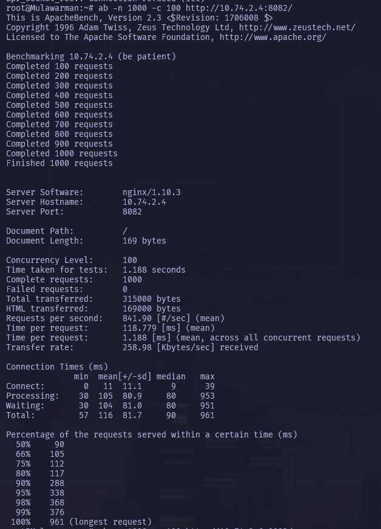
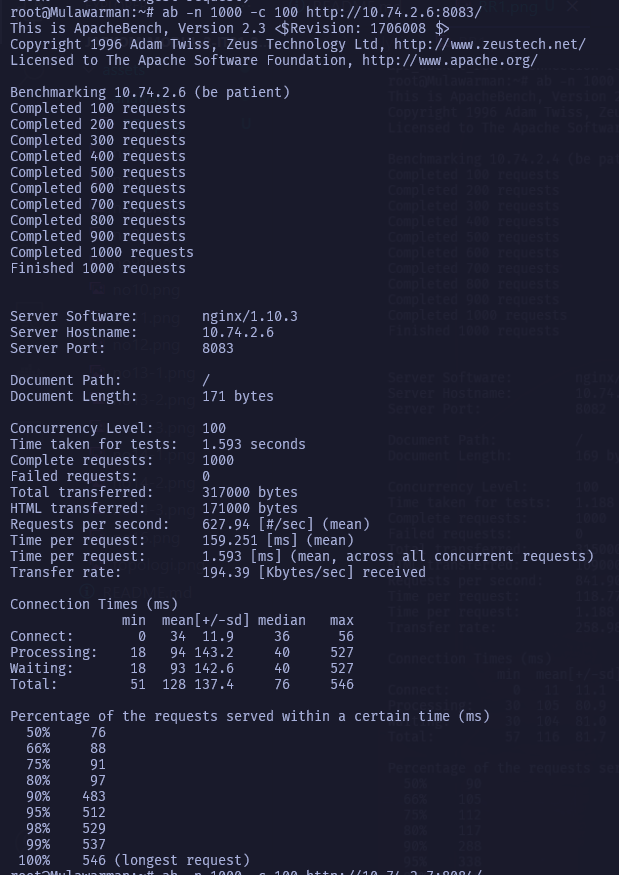
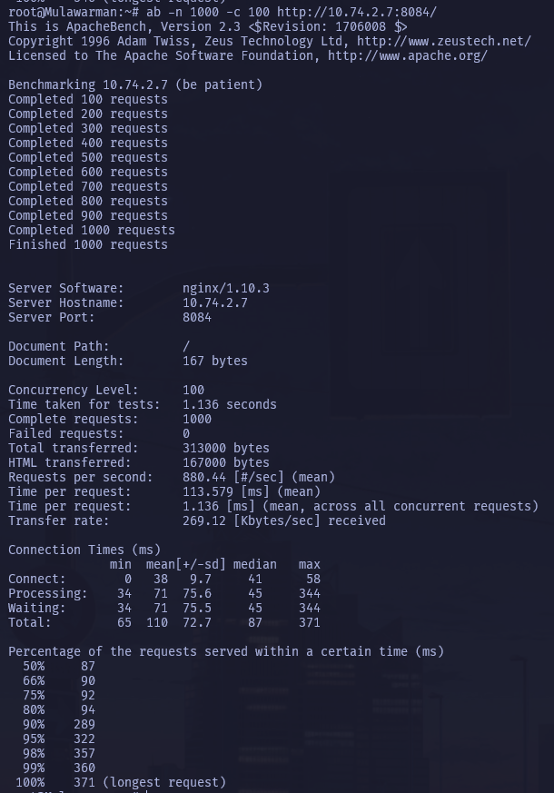
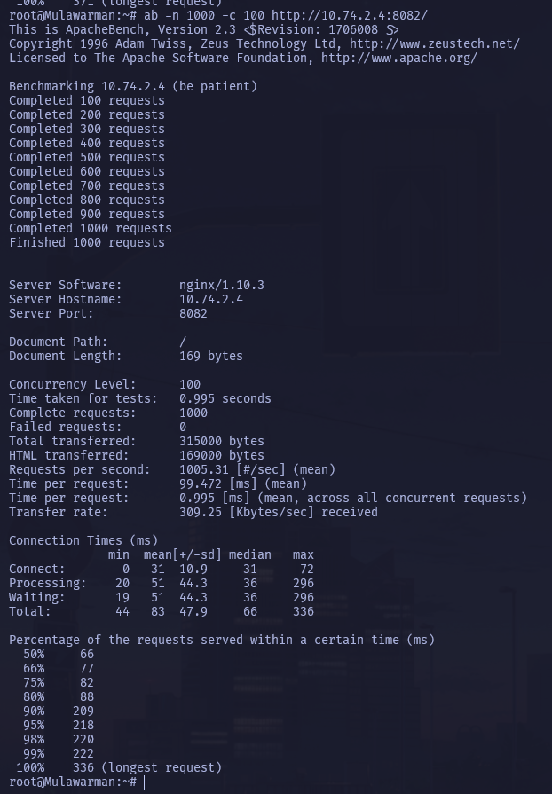
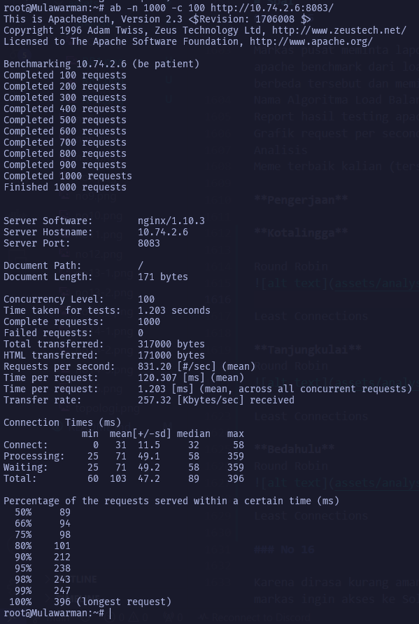
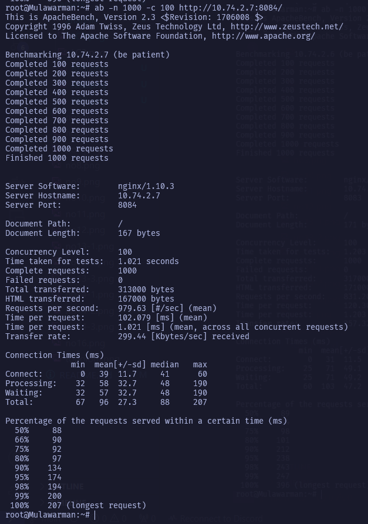
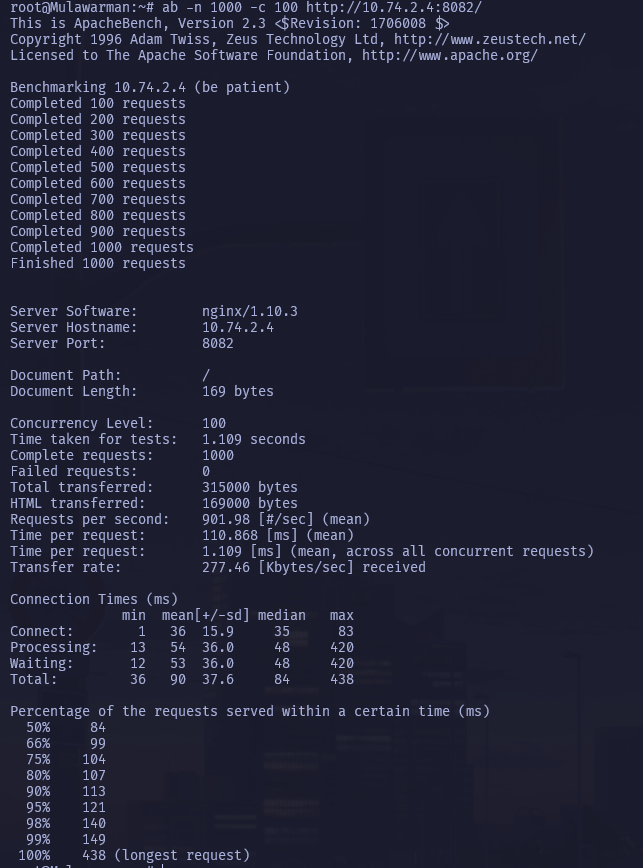
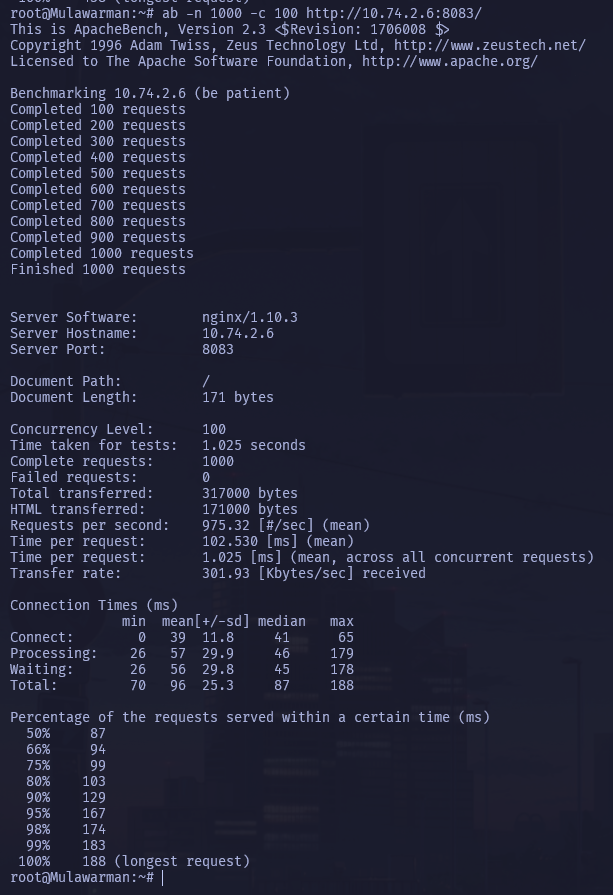
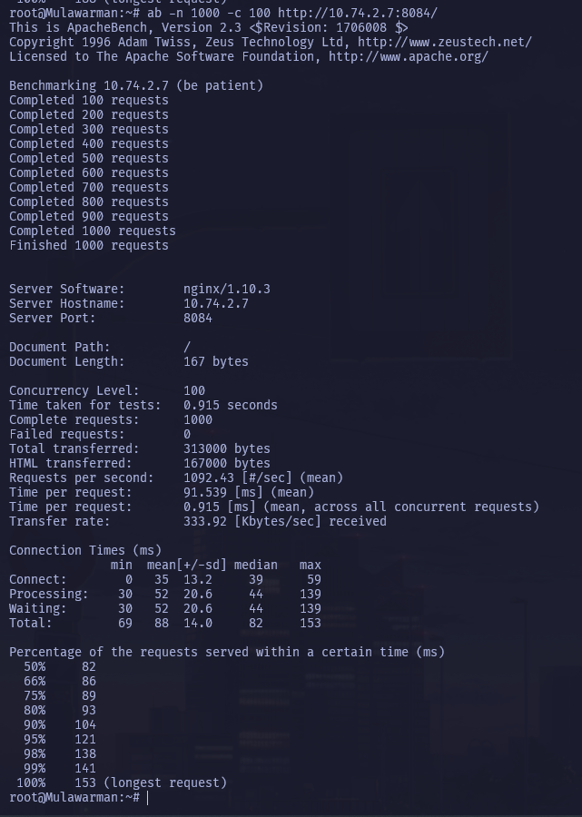

# Hasil Analisis (No. 15)

**NOTE**: Variabel yang diambil yaitu:
- Failed requests
- RPS (requests/sec)
- TRP (time/req)
- Transfer Rate

## Round Robin

### Kotalingga

`0, 841.9, 118.8, 258.98`

### Tanjungkulai

`0, 627.9, 159.2, 194.39`

### Bedahulu

`0, 880.4, 113.6, 269.12`

**Analisis** - dapat terlihat bahwa webserver Bedahulu memiliki keunggulan dibandingkan dengan webserver lainnya, mulai dari RPS, TRP, dan transfer rate untuk jenis algoritma ini.

## Least Connections

### Kotalingga

`0, 1005.3, 99.5, 309.25`

### Tanjungkulai

`0, 831.2, 120.3, 257.32`

### Bedahulu

`0, 979.6, 102.1, 299.44`

**Analisis** - dapat terlihat bahwa dalam skenario penggunaan least_conn, Kotalingga memiliki keunggulan yang tipis dibandingkan dengan Bedahulu. Tanjungkulai masih berada di paling bawah sama seperti hasil dari Round Robin, sehingga pilihan kemungkinan besar antara Kotalingga atau Bedahulu.

## IP Hash

### Kotalingga

`0, 902, 110.9, 277.46`

### Tanjungkulai

`0, 975.3, 102.5, 301.93`

### Bedahulu

`0, 1092.4, 91.5, 333.92`

**Analisis** - Bedahulu kembali unggul dibandingkan webserver lainnya, tetapi di skenario ini Tanjungkulai bekerja dengan baik, dengan RPS yang hampir menyentuh 1000, sedangkan Kotalingga meskipun bisa dibandingkan dengan hasil terbaik Round Robin, di skenario ini tidak unggul.

## Kesimpulan

Berdasarkan hasil diatas, yaitu hasil dari 3 algoritma load balancing yang dipakai (RR, Least Conn, dan IP Hash), dapat ditarik kesimpulan sebagai berikut: 

**Bedahulu** menunjukkan performa rata-rata terbaik, dengan posisi ke-1 di RR, ke-2 di LC, dan ke-1 lagi di IP Hash. RPS > 1000 disentuh dua kali oleh Kotalingga di LC dan **Bedahulu** di IP Hash, dengan rekor tertinggi dipegang oleh **Bedahulu (IP Hash)** dengan RPS `1092.43`. Kasus yang sama terjadi di TRP dan transfer rate, dimana TRP terkecil dan juga transfer rate terbesar diraih oleh **Bedahulu**. Berdasarkan hasil ini, dapat dipastikan bahwa web server terbaik dari analisis kami yaitu **Bedahulu**.

meme:
ashessh10 about my physical and mental health:
